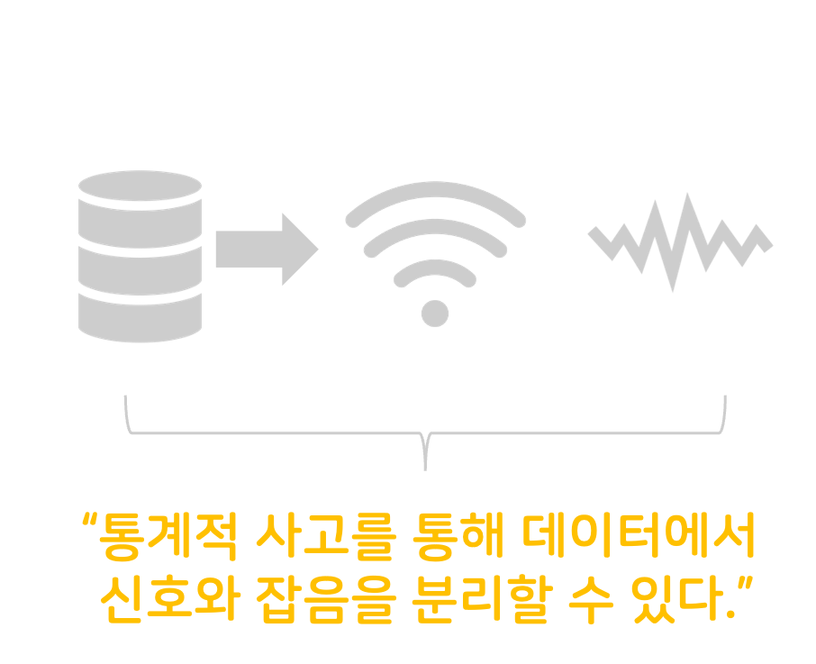

```{r setup, include=FALSE}
options(htmltools.dir.version = FALSE)
knitr::opts_chunk$set(
  fig.width=9, fig.height=3.5, fig.retina=3,
  out.width = "100%",
  cache = FALSE,
  echo = TRUE,
  message = FALSE, 
  warning = FALSE,
  fig.show = TRUE,
  hiline = TRUE
)
```

```{r xaringan-themer, include=FALSE, warning=FALSE}
library(xaringanthemer)
style_mono_light(
  base_color = "#23395b",
  header_font_google = google_font("Do+Hyeon"),
  text_font_google   = google_font("Jua", "300", "300i"),
  code_font_google   = google_font("Fira Mono"),
  colors = c(
  red = "#f34213",
  purple = "#3e2f5b",
  orange = "#ff8811",
  green = "#136f63",
  white = "#FFFFFF",
  blue = '#0000FF',
  yellow = '#ffdd00'
)
)
```

## 데이터 기반 의사결정

###비즈니스에서는 항상 **.red['문제']**에 직면하며, **.red['문제']**를 해결하기 위해 **.blue['결정']**을 내린다.

.pull-left[

]

.pull-right[


]

---

class:top

# 데이터 분석에 관한 오해

--

###.center[.red[데이터 분석은 이공계 쪽의 전문 분야가 아닌가요?]]

--

###.center[.red[MD가 데이터 분석 능력이 있어야 하나요?]]

--

###.center[.red[데이터 분석을 하려면 특별한 '지식'이 필요한 게 아닌가요?]]

--

.center[]


---

## 데이터 분석에 관한 오해

###**데이터 분석이 중요하다면, MD도 데이터 분석을 직접 해야 할까요?**

.center[]

---

## 데이터 분석에 관한 오해

###**데이터 분석이 중요하다면, MD도 데이터 분석을 직접 해야 할까요?**

.center[]

---

## 데이터 분석에 관한 오해


```{r image-resize, echo=FALSE}

```

.pull-left[
*  #### 문제 정의 능력   
*  #### 데이터 추출/가공
*  #### 데이터 분석력
*  #### 커뮤니케이션 스킬
]

.pull-right[
* #### 데이터의 구성: 신호 + 잡음   
]

---
class: inverse center top

# 데이터 리터러시 <br>(Data Literacy)

### 데이터를 해석하고 목적에 맞게 활용할 수 있는 능력

.pull-left[
### .yellow[1) 문제 정의 능력]
#### 데이터를 통해 풀고자 하는 문제를<br>정확하게 정의할 수 있어야 한다.
]

.pull-left[
### .yellow[2) 데이터 추출/가공]
#### 정의된 문제에 필요한 데이터를 추출,<br>분석할 수 있는 형태로 가공하야 한다.
]

.pull-left[
### .yellow[3) 데이터 분석력]
#### 수집/가공된 데이터에서 의미있는<br>신호, 패턴을 찾을 수 있어야 한다.

]

.pull-left[
### .yellow[4) 커뮤니케이션 스킬]
#### 분석된 결과를 공유할 수 있어야 한다.
]

---

class: inverse center top

# 통계적 사고 <br>(Statistical Thinking)

### 데이터에서 .orange['신호']와 .orange['잡음']을 구분해서 생각

--

.center[]

---

class: inverse center top

# 데이터 분석에 관한 오해<br> <br>

.center[]

---
class: left top

## 데이터 분석 과정은 이렇게 구성되어 있습니다.

.center[]

*  #### 데이터베이스에서 데이터를 추출할 수 있는 `SQL` 언어를 배웁니다.
*  #### 추출한 데이터를 분석하고 시각화, 자동화 할 수 있는 `R`프로그래밍 언어를 배웁니다.
*  #### 자신만의 데이터 분석 프로젝트를 수행하고 이를 공유합니다.

---

## 실무에서 'SQL'과 'R'을 할 수 있는 MD가 된다면?

--

### 1. 정말로 할 수 있냐고 의심을 받습니다.
 - 현장에서 아직까지 MD가 SQL과 R을 할 수 있는 사람은 없었습니다. 다만, 배우고자 하려는 MD는 많습니다.

--

### 2. MD 조직이 아닌 데이터 분석 조직에서 일을 하게 될 수도 있습니다.
- R과 SQL을 능숙히 하는 데이터 분석가, 데이터 마케터도 흔한 것은 아닙니다.
 
--

### 3. 커리어에 강력한 무기가 될 수 있습니다.

---

## 이 수업을 통해 여러 분이 얻길 바라는 점

--

### 1. 수업을 100% 이해하며 따라오지 못하여도 상관 없습니다.

--

### 2. 스스로 학습하는 능력과 데이터 분석과 활용이 무엇인지 느꼈으면 좋겠습니다.

--

### 3. SQL과 R이라는 도구를 'EXCEL' 처럼 생각할 수 있었으면 좋겠습니다.

--

### 4. 데이터를 활용하는 즐거움을 느낄 수 있었으면 좋겠습니다.

--

### 5. 배운 것 중에 단, 하나라도 자기의 것으로 만들 수 있었으면 좋겠습니다.
