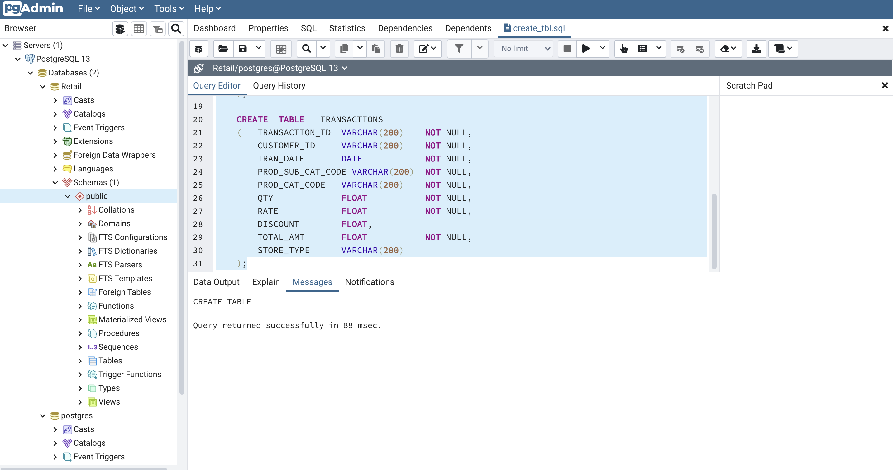
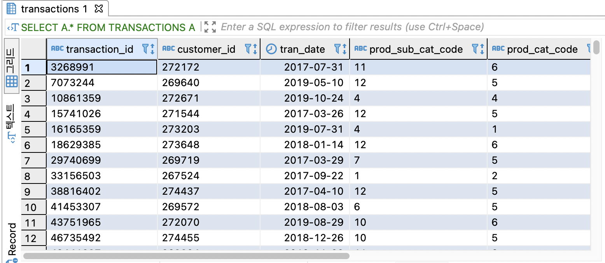
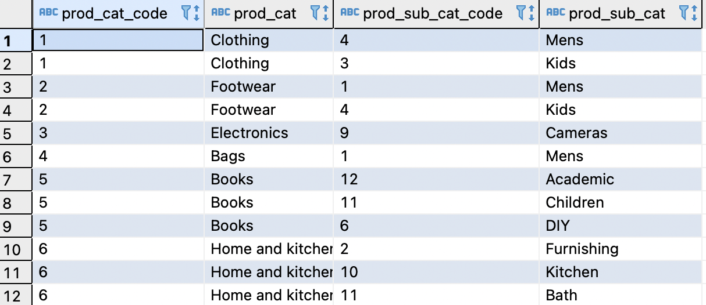
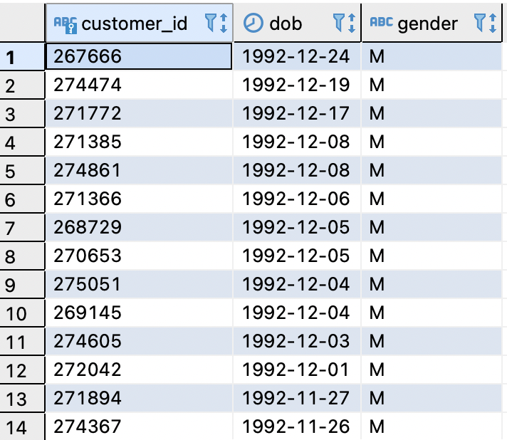
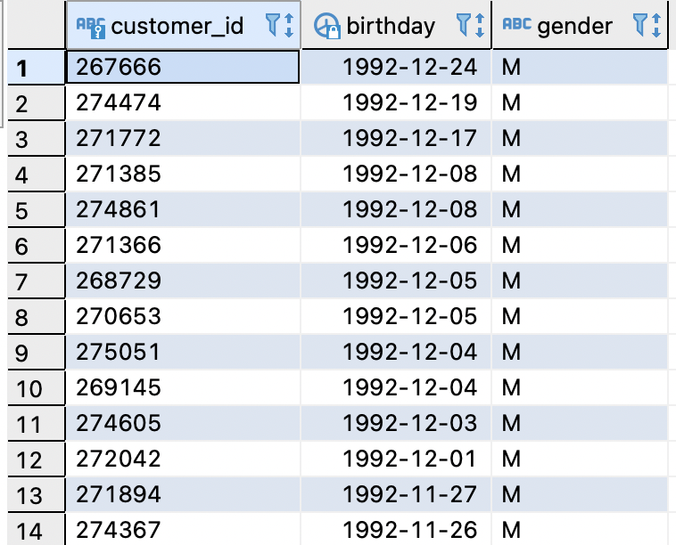

```{r setup, include=FALSE}
options(htmltools.dir.version = FALSE)
knitr::opts_chunk$set(
  fig.width=9, fig.height=3.5, fig.retina=3,
  out.width = "100%",
  cache = FALSE,
  echo = TRUE,
  message = FALSE, 
  warning = FALSE,
  fig.show = TRUE,
  hiline = TRUE
)
```

```{r xaringan-themer, include=FALSE, warning=FALSE}
library(xaringanthemer)
style_mono_light(
  base_color = "#23395b",
  header_font_google = google_font("Do+Hyeon"),
  text_font_google   = google_font("Jua", "300", "300i"),
  code_font_google   = google_font("Fira Mono"),
  colors = c(
  red = "#f34213",
  purple = "#3e2f5b",
  orange = "#ff8811",
  green = "#136f63",
  white = "#FFFFFF",
  blue = '#0000FF',
  yellow = '#ffdd00'
)
)
```

## SQL (Structured Query Language)

### `SQL`은 <u>관계형 `데이터베이스`의 표준 언어</u>이다.<br>(참고) `영어`는 `영미권`의 표준 언어이다.

* #### `SQL`은 <u>구조적(structured)</u>이고, <u>집합적(set-based)</u>이고 <u>선언적(declarative)</u>인 언어다.
  1. 원하는 결과 집합을 구조에 맞춰 질의할 뿐, 구체적인 프로세싱 과정은 프로그래밍하지 않아도 된다.
  1. 자연어에 가까운 언어이기 때문에, 프로그래머가 아니더라도 쉽게 접근할 수 있다.

.pull-left[

]

.pull-right[


]

---
class: inverse center middle

# 실습 환경 구축하기

```
SQL 설치 및 실습 테이블 구축
```

---
class: inverse left top

# SQL 설치하기

### SQL은 SQL이라는 문법을 사용해서 RDBMS를 이용할 수 있다.<br>RDBMS는 여러 종류가 있으며, 기본적 구조는 동일하나 약간의 차이는 존재한다.

#### 대표적인 SQL 기반 RDBMS 종류

.pull-left[
[RDBMS 환경의 SQL]

]

.pull-right[
[클라우드 환경의 SQL]

]

---

### PostgreSQL 설치  

#### PostgreSQL은 오픈 소스(Open Source)로 누구나 .blue[무료]로 사용할 수 있는 데이터베이스 시스템

.pull-left[

]

.pull-right[


`PostgreSQL` 페이지에서 OS에 맞는 프로그램 다운로드

]

### 다음 <u>[**링크**](https://github.com/yihui/xaringan)</u>로 접속하여, 사용하는 OS에 맞춰 다운로드 진행

---

### PostgreSQL 설치  

#### 다운로드 받은 파일을 실행하면 아래와 같은 설치 화면이 나오고, 'next' 버튼을 눌러 다음 단계로 진행

.pull-left[

]

.pull-right[


]

`password` 설정화면에서는 설치가 완료되면 **데이터베이스에 접속할 때 필요한 비밀번호**이므로 설정 후 반드시 기록

---

### PostgreSQL 설치  

#### 다음 화면은 포트를 설정하는 화면으로, .red['5432']로 그대로 설정하여 진행

.pull-left[

]

.pull-right[


]

오른쪽 화면에서는 **'Stack Builder may be user ~~~'** 부분은 **.red[체크 해제]**하고 설치를 마무리

---

### PostgreSQL 설치  

#### 설치가 완료되면 아래와 같이 설치가 된 것을 확인 가능<br> Windows 사용자의 경우 시작 버튼에서 `PostgreSQL`이 설치된 것을 확인

.pull-left[


]

.pull-right[


]
  
#### 다음으로 **.red['pgAdmin4']** 파일을 실행하면 오른쪽 화면과 같이 나타나고, 참고로 접속시 비밀번호 입력하는 창이 나타나면<br>설치시 설정하였던 비밀번호를 입력

---

### 실습 데이터 테이블 구축하기 

#### 실습 환경을 위해 실습용 데이터베이스를 구축<br>Databases에서 마우스 오른쪽 버튼을 눌러 'Create -> Database'를 클릭

.pull-left[


]

.pull-right[


]
  
#### 오른쪽 화면과 같이 창이 뜨면, Database 이름을 지정. 본 실습에서는 'Retail'이라는 데이터베이스명을 생성

---

### 실습 데이터 테이블 구축하기 

#### 다음으로 만들어진 데이터베이스 트리 구조에서 아래와 같이 'Schemas - Public'에 마우스 오른쪽 버튼 클릭하여, `Query Tool`을 선택

.center[

]

---

### 실습 데이터 테이블 구축하기 

#### `Query Tool`이 실행되면 .orange[불러오기 모양의 폴더]를 선택한 후 `create_tbl.sql` 파일을 로드<br>쿼리 편집창에서 .orange['Ctrl+A']로 전체를 선택한 후 .orange['F5'] 를 눌러 쿼리를 실행.

.center[

]

---

### 실습 데이터 테이블 구축하기 

#### 왼쪽 트리 구조에서 **'Tables'**를 열어보면 아래와 같이 네 개의 테이블이 생성된 것을 확인

.center[

]

#### 다음으로 각 테이블에 실습할 예제의 데이터 업로드 진행

---

### 실습 데이터 테이블 구축하기 

#### 먼저 `city` 테이블 업로드 진행. `city` 테이블에 마우스 오른쪽 버튼을 클릭하여, .orange['Export/Import...'] 버튼 클릭

.pull-left[


]

.pull-right[


]

#### 데이터 Import 후 새로운 쿼리 편집창을 띄운 다음과 같이 입력 후 쿼리 실행
```sql
select * from city;
```

---

### 실습 데이터 테이블 구축하기 

#### 나머지 3개의 테이블도 같은 과정으로 데이터를 업로드하여, 정상적으로 데이터가 업로드가 되었는 지 확인

.pull-left[

```sql
select * from city;

select * from customer;

select * from prod_cat_info;

select * from transactions;
```

]

.pull-right[


]

#### 실습을 위한 테이블 생성 및 데이터 업로드가 모두 완료<br>.orange[pgAmind4]의 쿼리 입력창에서 실습을 진행해도 되지만, 훨씬 편리한 인터페이스를 갖춘 .orange['DBeaver']를 설치하여 실습을 진행 
---

### DBeaver 설치

#### DBeaver는 SQL 클라이언트이자 데이터베이스 관리도구로, PostgreSQL 처럼 무료로 사용할 수 있는 오픈소스 소프트웨어이다.<br>DBeaver는 PostgreSQL 뿐만 아니라 Oracle, MySQL, MariaDB, SQLserver, Redshift 등 다양한 DB를 지원한다.

다음의 주소로 접속하여, 디비버 프로그램 다운로드<br>
https://dbeaver.io/download/

.center[

]

각 사용자 환경에 맞춰 파일을 다운로드 후 설치 진행

---

### DBeaver 설치

#### 설치가 완료되면 아래와 같이 데이터베이스를 선택하는 화면이 나오고, 실습을 위해 'PostgreSQL'을 선택<br>PostgreSQL을 설치하고 나면 아래와 같은 화면이 나오는데, Host는 데이터베이스가 PC에 설치가 되어 있기 때문에 .blue['localhost']입력<br>다음으로 'Database'명을 입력하는 곳이 있는데, 여기에는 이전에 생성하였던 데이터베이스 이름을 입력 .blue['Retail']<br>'Password' 입력하는 곳에는 .blue[설치시 설정했던 비밀번호를 입력]한 후 모든 입력이 완료가 되면 아래의 .blue['Test Connection'] 클릭

.pull-left[

]

.pull-right[

]

정상적으로 연결이 완료가 되면 오른쪽 이미지와 같이 연결되었다는 메시지가 나오면, 확인 후 완료

---

### DBeaver 설치

#### 디비버 좌측 트리 구조에서 'Retail' 데이터베이스를 클릭하면 각 네 개의 테이블이 있는 것을 확인<br>상단 SQL 편집기 탭에서 SQL 편집기를 클릭하면, SQL 구문을 입력할 수 있는 편집창이 나타나게 됨

.pull-left[

]

.pull-right[

]

**'pgAdmin4'**의 쿼리 편집기에서 입력한 것과 같이 아래와 같이 쿼리문을 작성한 후 'ctrl+Enter'을 입력하면,<br> 정상적으로 데이터가 나오는 것을 확인
```sql
select * from transactions;
```
---
class: inverse center middle

# SQL 기초 - 기본 SQL 작동원리 이해
```
SELECT문의 기본 구조 이해
```

---

## SELECT문의 기본 구조 이해

###원하는 데이터를 추출하기 위해서는 .blue[업무적인 요구사항]을 먼저 정의해야 한다.
* #### SQL을 작성한다는 것은 업무적인 요구사항을 SQL 문법(Syntax)을 이용하여 기술하는 것이다.
* #### <u>업무적인 요구사항이 구체적이어야</u> 정확한 SQL 문을 작성할 수 있고, 그에 따라 원하는 데이터 집합을 조회할 수 있다.

### SELECT 문은 데이터베이스에 저장된 .orange[데이터를 조회]하는 구문이다.
* #### 저장된 데이터를 <u>원래 값의 형태 그대로 조회하거나 가공하여 조회</u>할 수 있다.<br>하지만, 테이블에 저장된 데이터 자체를 변경하지는 않는다.

---

### SELECT문의 기본 구조 이해

#### SELECT 문의 논리적 처리 순서

.pull-left[

]

.pull-right[
1. '거래' 내역에서
1. 각 고객의 거래건수, 총 거래액, 최근 거래일자를 추출
1. 단, 0원 초과 거래건(취소 거래건도 포함),<br>2회 이상 주문한 고객만 추출
1. 데이터 결과는 총 거래액이 가장 큰 순서대로 나타내라.
]

* **SELECT** 컬럼, 계산값
* **FROM** 테이블명
* **WHERE** 조건(필터)
* **GROUP BY** 그룹화(컬럼)
* **HAVING** 그룹화 된 결과에서 사용되는 조건(필터)
* **ORDER BY** 컬럼명(OR 컬럼별칭 OR 컬럼 위치)
* **LIMIT** 제한된 행의 수만 반환 (단, Oracle에서는 없는 기능)

### SELECT문은 데이터베이스의 데이터를 조회하는 구문이다.
---

### SELECT문 - 엑셀 데이터 비교

.pull-left[


* SELECT문의 컬럼과 계산값은 엑셀의 각 열(column)과 대응<br>

* WHERE절과 HAVING절 조건 충족되지 않은 데이터는 제외<br>

* ORDER BY절은 데이터 정렬시 `SUM(TOTAL_AMT)` 기준<br>내림차순 정렬
]

.pull-right[
&emsp;&emsp;
]

---

### SELECT문은 기본적으로 `SELECT`절과 `FROM`절로 구성

.pull-left[
```sql
  SELECT    A.CUSTOMER_ID
        ,   A.TRAN_DATE
		,   A.RATE
		,   A.QTY
		,   A.TOTAL_AMT
	FROM	TRANSACTIONS A;
```
]

.pull-right[

]

#### TABLE명 뒤에 'A' 는, 테이블을 구분할 수 있는 명칭(Allias)으로 쿼리 작성시엔 테이블마다 명칭을 지정하는 것이 좋다.<br>명칭은 각 테이블을 직관적으로 이해할 수 있는 명칭이나, 'A-B-C...' 등으로 자유롭게 지정

.pull-left[
```sql
  SELECT    A.*
	FROM	TRANSACTIONS A;
```
]

.pull-right[

]


#### SELECT절에 `*`을 입력하면, 해당 테이블의 모든 컬럼을 출력한다.

---

### 특정 컬럼 명은 변경해 조회하려면 'AS'를 이용한다.

단, 특정 컬럼 명을 변경하여 조회하더라도 원 데이터의 컬럼명이 변경되는 것은 아니다.

.pull-left[
```sql
SELECT	
         A.CUSTOMER_ID	  AS 고객번호
	,	A.TRAN_DATE		AS 거래일자
	,	A.RATE			 AS 판매가
	,	A.QTY			  AS 주문수량
	,	A.TOTAL_AMT		AS 주문금액
FROM	TRANSACTIONS A;   
```
]

.pull-right[

]

### 일반적으로 컬럼 별칭('Column Alias')은 집계된 컬럼, 함수 이용 구문,<br>동일 컬럼 사용시에 코드 가독성 측면에서 사용된다.

---

### `DISTINCT`를 이용하면 중복을 제외하고 데이터를 조회할 수 있다.

.pull-left[
&emsp;&emsp;&emsp;&emsp;<br>
&emsp;&emsp;&emsp;&emsp;전체 데이터 조회 결과
]

.pull-right[
```sql
SELECT  DISTINCT A.STORE_TYPE
FROM    TRANSACSTIONS A;
```
<br>

<br>
`DISTINCT`를 사용하여 조회한 결과

]

---

### `SELECT`절에서는 컬럼(Column)과 함께 `Literal`을 기술할 수 있다.
* 리터럴에는 .blue['문자 리터럴', '숫자 리터럴', '날짜 리터럴']이 있다.
* 문자 리터럴은 **Single Quotation(')**으로 감싸서 기술하고, 날짜 리터럴은 **DATE** 키워드와 함께 기술한다.

#### [리터럴 사용 예시]

```sql
SELECT      B.CITY_CODE
     ,      B.CITY_NAME
     ,      'KOREA'                 AS CHAR_LITERAL
     ,      DATE '2021-06-04'       AS DATE_LITERAL
     ,      82                      AS NUM_LITERAL
FROM        CITY B;
```

**[조회 결과]**
.left[

]

---

### `SELECT`절에서는 컬럼이나 리터럴에 대해 연산자를 사용할 수 있다.

* 산술 연산자는 <u>숫자 값</u>과 <u>날짜 값</u>에 대해 사용할 수 있다.<br>

    - <u>숫자 값</u> 간에 산술 연산은 수학에서 **사칙연산(*, /, +, -)**과 동일하게 수행되며, 우선 순위를 지정하기 위해 괄호를 사용한다. 
    
    - <u>날짜 값과 숫자 값</u> 간에는 **더하기(+), 빼기(-) 연산**만 가능하며, 숫자 값은 일수(day)로 처리된다.
    - <u>날짜 값</u>간에는 **빼기(-) 연산**만 가능하며, 결과 값으로 두 날짜 간의 일수(day)가 나온다.<br>

* 연결 연산자는 <u>**문자 값**</u>에 대해 사용할 수 있다.<br>

    - 연결 연산자(||)는 여러 개의 문자 값들을 연결시켜 하나의 문자 값을 만들어낸다.
    
    - 문자 값이 아닌 피연산자는 문자 값으로 변환환 뒤에 연결시킨다.  

.pull-left[

```sql
SELECT  A.CUSTOMER_ID
     ,  A.TOTAL_AMT
     ,  (A.TOTAL_AMT + 1000) / 2                AS NEW_TOTAL_AMT
     ,  A.TRAN_DATE + 1                         AS TRAN_DATE_PLUS_1DAY
     ,  TRAN_DATE - 1/24/60/60		          AS TRAN_DT_MINUS_1SEC
     ,  A.TRAN_DATE - DATE '2019-02-01'         AS DIFF_DAYS
FROM    TRANSACTIONS A;
```    

]

.pull-right[


]

---

### `SELECT`절에서는 컬럼이나 리터럴에 대해 연산자를 사용할 수 있다.

* 산술 연산자는 <u>숫자 값</u>과 <u>날짜 값</u>에 대해 사용할 수 있다.<br>

    - <u>숫자 값</u> 간에 산술 연산은 수학에서 **사칙연산(*, /, +, -)**과 동일하게 수행되며, 우선 순위를 지정하기 위해 괄호를 사용한다. 
    
    - <u>날짜 값과 숫자 값</u> 간에는 **더하기(+), 빼기(-) 연산**만 가능하며, 숫자 값은 일수(day)로 처리된다.
    - <u>날짜 값</u>간에는 **빼기(-) 연산**만 가능하며, 결과 값으로 두 날짜 간의 일수(day)가 나온다.<br>

* 연결 연산자는 <u>**문자 값**</u>에 대해 사용할 수 있다.<br>

    - 연결 연산자(||)는 여러 개의 문자 값들을 연결시켜 하나의 문자 값을 만들어낸다.
    
    - 문자 값이 아닌 피연산자는 문자 값으로 변환환 뒤에 연결시킨다.  

.pull-left[

```sql
SELECT  C.CUSTOMER_ID
     ,  C.DOB
     ,  C.GENDER
     ,  C.CUSTOMER_ID||'고객의 생년월일은'||C.DOB||'이고,'||'성별은'||C.GENDER||'입니다' AS CUST_INFO
FROM    CUSTOMER C;
```    

]

.pull-right[


]

---

### `NULL`

* 널(NULL)은 **.red[값이 없거나 정해지지 않은 것]**을 의미하며, 0 또는 공백(' ')과는 다르다
* NULL을 포함한 산술 연산의 결과는 항상 NULL이다

.pull-left[

**[NULL 조회 및 연산]**
```sql
SELECT  A.CUSTOMER_ID
    ,   AMT_2019
    ,   AMT_2020
    ,   AMT_2019 + 500
    ,   AMT_2020 * 10
    ,   AMT_2019 - NULL
    ,   AMT_2019 + AMT_2020
FROM    CUST_TRAN A
```
]


.pull-right[
**[조회 결과]**


]

---

### 주석 Comments

* 주석은 SQL문의 결과에 영향을 미치지 않으며, 관련된 정보나 메모 등을 기술할 수 있다.

    - 단일 행 주석 : -- 뒤에 주석 내용을 기술한다. (줄이 바뀌기 전까지 주석이 유지된다.)
    
    - 다중 행 주석 : **/\* 와 \*/** 사이에 주석 내용을 기술한다. (줄이 바뀌어도 주석이 유지된다.)

.pull-left[
**[단일 행 주석 사용]**
```sql
SELECT
        A.CUSTOMER_ID   -- 고객번호
     ,  A.DOB           -- 생년월일
     ,  A.GENDER        -- 성별
     ,  A.CITY_CODE     -- 거주지 코드
        -- 거주지 코드는 city table과 JOIN
FROM    CUSTOMER A;
```
]

.pull-right[
**[다중 행 주석 사용]**
```sql
SELECT
        A.CUSTOMER_ID   
     ,  A.DOB           
     ,  A.GENDER        
     ,  A.CITY_CODE     
        /* 고객번호, 생년월일, 성별, 거주지코드
        단, 거주지명은 city table과 JOIN하여,
        확인 가능
        */
FROM    CUSTOMER A;
```
]

---
## WHERE절

> 만약 다음과 같은 데이터를 조회를 해야 한다면 어떻게 처리해야 할까?
>
> "30대 고객 데이터만 뽑아서 주로 어떤 카테고리에서 구매하는지 파악해주세요"

### SELECT 문에 WHERE절을 사용하여 조회되는 데이터(행)을 제한할 수 있다.

.pull-left[

```sql
SELECT  *
FROM    테이블명
WHERE   조건
;
```
]

.pull-right[

]
<br>

#### * WHERE 절 조건의 종류는 `비교 조건`, `논리 조건`, `IN 조건`, `BETWEEN 조건`, `LIKE 조건`, `IS (NOT) NULL` 이 있다.

---

### WHERE절 - 비교 조건

#### 비교 조건에는 .orange['같다(=)'], .orange['크다(>)'], .orange['크거나 같다(>=)'], .orange['같지 않다(<>)'], .orange['작다(<)'], .orange['작거나 같다(<=)']가 있다. 

.pull-left[
**[비교 조건 같다(=) 사용 예제]**

```sql
SELECT  A.CUSTOMER_ID
    ,   A.TRAN_DATE
    ,   A.TOTAL_AMT
    ,   A.STORE_TYPE
FROM    TRANSACTIONS A
WHERE   STORE_TYPE = 'OnlineShop';
```


]

.pull-right[

**[비교 조건 크거나 같다(>=) 사용 예제]**
```sql
SELECT  A.CUSTOMER_ID
    ,   A.TRAN_DATE
    ,   A.DISCOUNT
    ,   A.TOTAL_AMT
FROM    TRANSACTIONS A
WHERE   A.DISCOUNT >= 500;
```


]

---

### 논리 조건

#### WHERE 절에 .orange['AND', 'OR'] 논리 조건을 사용하면 조건들을 결합하여 제한할 수 있다.

```{r table1, echo=FALSE, reuslt="asis"}
library(knitr)
library(kableExtra)
table1 <- data.frame(a = c('(조건1) AND (조건2)', '(조건1) OR (조건2)' ), b = c('조건1과 조건2가 모두 TRUE이면, AND 논리 조건 결과는 TRUE)', '조건1과 조건2 중 하나라도 TRUE이면, OR 논리 조건 결과는 TRUE)'))
kbl(table1, col.names = NULL) %>%
    kable_paper("hover", full_width = F)
```

.pull-left[
**[논리 조건 `AND` 예제]**
```sql
SELECT  A.CUSTOMER_ID
    ,   A.DOB
    ,   A.GENDER
    ,   A.CITY_CODE
FROM    CUSTOMER A
WHERE   A.GENDER = 'F'
AND     A.DOB >= TO_DATE('1990-01-01', 'YYYY-MM-DD')
```


]

.pull-right[
**[논리 조건 `OR` 예제]**
```sql
SELECT  A.CUSTOMER_ID
    ,   A.DOB
    ,   A.GENDER
    ,   A.CITY_CODE
FROM    CUSTOMER A
WHERE   A.GENDER = 'F'
OR      A.CITY_CODE = '5';
```


]

---

### AND, OR 논리 조건 간 우선 순위

#### 괄호를 사용하면 괄호 안 논리 조건을 우선 순위로 하여 처리가 된다.

```sql
SELECT  A.CUSTOMER_ID
    ,   A.DOB
    ,   A.GENDER
    ,   A.CITY_CODE
FROM    CUSTOMER A
WHERE   ( A.GENDER = 'F'
OR      A.DOB >= TO_DATE('1990-01-01', 'YYYY-MM-DD') )
AND     A.CITY_CODE = '5'
```
.pull-left[

]

#### WHERE 절에서 AND와 OR 논리 조건이 함께 사용될 경우,<br>괄호를 사용하여 명시적으로 우선순위를 지정해주는 것이 좋다.

---

### IN 조건

> 만약 다음과 같은 데이터를 조회를 해야 한다면 어떻게 처리해야 할까?
>
> "서울과 인천 지역에 거주하는 고객의 정보만 확인해주세요"

```{r table2, echo=FALSE, reuslt="asis"}
table2 <- data.frame(a = c('지역 IN (서울, 인천)', '지역 NOT IN (서울, 인천) ' ), b = c('지역 IN List(서울, 인천) 중 어떤 값과 같다', '지역 IN List(서울, 인천)의 모든 값과 같지 않다.'))
kbl(table2, col.names = NULL) %>%
    kable_paper("hover", full_width = F)
```

.pull-left[
**[IN 조건 사용 예제]**
```sql
SELECT  A.*
FROM    CITY A
WHERE   A.CITY_CODE IN ('5', '10');
```

[결과]<br>


]

.pull-right[
**[NOT IN 조건 사용 예제]**
```sql
SELECT  A.*
FROM    CITY A
WHERE   A.CITY_CODE NOT IN ('5', '10');
```
[결과]<br>


]

---

### BETWEEN 조건

> 만약 다음과 같은 데이터를 조회를 해야 한다면 어떻게 처리해야 할까?
>
> "2019년 1월부터 3월까지 거래내역을 확인하고 싶어요"

```{r table3, echo=FALSE, reuslt="asis"}
table3 <- data.frame(a = c('거래일자 BETWEEN 2019-01-01 AND 2019-03-31', '거래일자 NOT BETWEEN 2019-01-01 AND 2019-03-31' ), b = c('거래일자가 2019년 1월 1일부터 2019년 3월 31일 사이에 있다', '거래일자가 2019년 1월 1일부터 3월 31일 사이에 있지 않다'))
kbl(table3, col.names = NULL) %>%
    kable_paper("hover", full_width = F)
```

.pull-left[
**[BETWEEN 조건 사용 예제]**
```sql
SELECT  A.*
FROM    TRANSACTIONS A
WHERE   A.TRAN_DATE BETWEEN TO_DATE('2019-01-01', 'YYYY-MM-DD') AND TO_DATE('2019-03-31', 'YYYY-MM-DD');
```

[결과]<br>


]

.pull-right[
**[NOT BETWEEN 조건 사용 예제]**
```sql
SELECT  A.*
FROM    TRANSACTIONS A
WHERE   A.TRAN_DATE NOT BETWEEN TO_DATE('2019-01-01', 'YYYY-MM-DD') AND TO_DATE('2019-03-31', 'YYYY-MM-DD');
```
[결과]<br>


]

---

### LIKE 조건

> 만약 다음과 같은 데이터를 조회를 해야 한다면 어떻게 처리해야 할까?
>
> "여성(Women) 관련 카테고리 정보를 모두 확인하고 싶어요"

```{r table4, echo=FALSE, reuslt="asis"}
table4 <- data.frame(a = c('컬럼명 LIKE \'문자열 패턴\'', '컬럼명 NOT LIKE \'문자열 패턴\'' ), b = c('컬럼명이 문자열 패턴과 일치한다', '컬럼명이 문자열 패턴과 일치하지 않는다.'))
kbl(table4, col.names = NULL) %>%
    kable_paper("hover", full_width = F)
```

#### LIKE 조건의 비교 값은 양쪽 모두 문자 값이어야 한다.
#### LIKE 조건의 (문자열 패턴)에서 특수 문자 `%`와 `_`는 아래와 같은 의미를 갖는다.

```{r table5, echo=FALSE, reuslt="asis"}
table5 <- data.frame(a = c('\'%\'', '\'_\'' ), b = c('0개 이상의 모든 문자와 일치', '1개의 모든 문자와 일치'))
kbl(table5, col.names = NULL) %>%
    kable_paper("hover", full_width = F)
```

---

### LIKE 조건

.pull-left[
**[LIKE 조건 '%' 패턴 매칭 예제1]**
```sql
SELECT  A.*
FROM    PROD_CAT_INFO A
WHERE   A.PROD_SUB_CAT LIKE 'Fic%';
```

[결과]<br>


]

.pull-right[
**[LIKE 조건 '%' 패턴 매칭 예제2]**
```sql
SELECT  A.*
FROM    PROD_CAT_INFO A
WHERE   A.PROD_SUB_CAT LIKE '%Fic%';
```
[결과]<br>


]

---

### LIKE 조건

.pull-left[
**[LIKE 조건 '_' 패턴 매칭 예제1]**
```sql
SELECT  A.*
FROM    PROD_CAT_INFO A
WHERE   A.PROD_SUB_CAT LIKE '_o___';
```

[결과]<br>


]

.pull-right[
**[LIKE 조건 '_' 패턴 매칭 예제2]**
```sql
SELECT  A.*
FROM    PROD_CAT_INFO A
WHERE   A.PROD_SUB_CAT LIKE '____';
```
[결과]<br>


]

---

### LIKE 조건

.pull-left[
**[NOT LIKE 조건 '%' 패턴 매칭 예제1]**
```sql
SELECT  A.*
FROM    PROD_CAT_INFO A
WHERE   A.PROD_SUB_CAT NOT LIKE '%o%';
```

[결과]<br>


]

.pull-right[
**[NOT LIKE 조건 '_' 패턴 매칭 예제2]**
```sql
SELECT  A.*
FROM    PROD_CAT_INFO A
WHERE   A.PROD_SUB_CAT NOT LIKE '_____';
```
[결과]<br>


]

---

### IS NULL 조건

.pull-left[
**[IS NULL 조건 사용 예제1]**
```sql
SELECT  A.CUSTOMER_ID
    ,   A.AMT_2019
    ,   A.AMT_2020
FROM    CUST_TRAN A
WHERE   A.AMT_2020 IS NULL;
```

[결과]<br>


]

.pull-right[
**[IS NOT NULL 조건 사용 예제1]**
```sql
SELECT  A.CUSTOMER_ID
    ,   A.AMT_2019
    ,   A.AMT_2020
FROM    CUST_TRAN A
WHERE   A.AMT_2020 IS NOT NULL;
```

[결과]<br>


]

---

### ORDER BY절

#### 컬럼 뒤에 ASC/DESC 키워드를 사용하여 데이터를 오름차순/내림차순으로 정렬을 할 수 있다.

.pull-left[
**[오름차순 정렬 : ASC 지정 (기본 값이므로 생략 가능)]**
```sql
SELECT  A.CUSTOMER_ID
    ,   A.DOB
    ,   A.GENDER
FROM    CUSTOMER A
WHERE   A.GENDER = 'M'
ORDER BY A.DOB ASC;
```

[결과]<br>


]

.pull-right[
**[내림차순 정렬 : DESC 지정]**
```sql
SELECT  A.CUSTOMER_ID
    ,   A.DOB
    ,   A.GENDER
FROM    CUSTOMER A
WHERE   A.GENDER = 'M'
ORDER BY A.DOB DESC;
```

[결과]<br>


]

---

### ORDER BY절

#### * SELECT절의 컬럼 별칭이나 컬럼 위치를 이용하여 정렬 순서를 지정할 수도 있다.

.pull-left[
**[컬럼 별칭(Column Alias) 이용 예시]**
```sql
SELECT  A.CUSTOMER_ID
    ,   A.DOB           AS BIRTHDAY
    ,   A.GENDER
FROM    CUSTOMER A
WHERE   A.GENDER = 'M'
ORDER BY BIRTHDAY DESC;
```

[결과]<br>


]

.pull-right[
**[컬럼 위치(Column Position) 이용 예시]**
```sql
SELECT   A.CUSTOMER_ID
    ,    A.DOB
    ,    A.GENDER
FROM     CUSTOMER A
WHERE    A.GENDER = 'M'
ORDER BY 2 DESC;
```

[결과]<br>


]

---

### ORDER BY절

#### ORDER BY절에 기술된 컬럼/표현식의 데이터 타입에 따라 정렬 순서가 달라질 수 있다.<br>*데이터 타입 (문자형, 숫자형, 날짜형 등)

.pull-left[
**[숫자 타입 정렬 예제]**
```sql
SELECT  A.CUSTOMER_ID
    ,   A.TRAN_DATE
    ,   A.TOTAL_AMT
FROM    TRANSACTIONS A
ORDER BY A.TOTAL_AMT DESC;
```

[결과]<br>


]

.pull-right[
**[문자 타입 정렬 예제]**
```sql
SELECT  A.CUSTOMER_ID
    ,   A.TRAN_DATE
    ,   TEXT(A.TOTAL_AMT)
FROM    TRANSACTIONS A
ORDER BY TEXT(A.TOTAL_AMT) DESC;
```

[결과]<br>


]
