```{r setup, include=FALSE}
options(htmltools.dir.version = FALSE)
knitr::opts_chunk$set(
  fig.width=9, fig.height=3.5, fig.retina=3,
  out.width = "100%",
  cache = FALSE,
  echo = TRUE,
  message = FALSE, 
  warning = FALSE,
  fig.show = TRUE,
  hiline = TRUE
)
```

```{r xaringan-themer, include=FALSE, warning=FALSE}
library(xaringanthemer)
style_mono_light(
  base_color = "#23395b",
  header_font_google = google_font("Do+Hyeon"),
  text_font_google   = google_font("Jua", "300", "300i"),
  code_font_google   = google_font("Fira Mono"),
  colors = c(
  red = "#f34213",
  purple = "#3e2f5b",
  orange = "#ff8811",
  green = "#136f63",
  white = "#FFFFFF",
  blue = '#0000FF',
  yellow = '#ffdd00'
)
)
```

## 함수를 사용한 데이터 가공

#### 각 DBMS에서 제공하는 내장 함수를 이용하여 각 행별로 데이터를 가공하거나 변환할 수 있다.

### 단일 행 함수의 종류


- 문자 함수 : 문자 데이터를 가공하는 단일 행 함수

- 숫자 함수 : 숫자 데이터를 가공하는 단일 행 함수

- 날짜 함수 : 날짜 데이터를 가공하는 단일 행 함수

- 변환 함수 : 데이터 유형을 변환하는 단일 행 함수

- NULL 함수 : NULL과 관련된 가공 및 변환을 하는 단일 행 함수

---

### 데이터 분석에서 많이 쓰이는 문자 함수

**LOWER(char)** : char의 모든 문자를 소문자로 변경하여 반환

**UPPER(char)** : char의 모든 문자를 대문자로 변경하여 반환

**CONCAT(char1, char2)** : char1 문자열과 char2 문자열을 연결하여 리턴


```sql
SELECT  LOWER(A.PROD_SUB_CAT)                 AS LOWER_CHAR
    ,   UPPER(A.PROD_SUB_CAT)                 AS UPPER_CHAR
    ,   CONCAT(A.PROD_CAT, A.PROD_SUB_CAT)    AS CONCAT_CHAR
FROM    PROD_CAT_INFO A;
```

[결과]
.left[
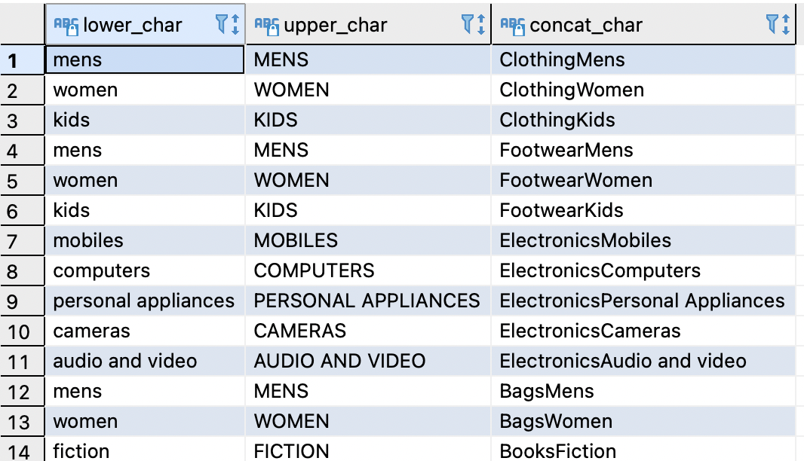
]

---

### 데이터 분석에서 많이 쓰이는 문자 함수

**SUBSTRING(char)** : 문자의 특정 위치를 추출

**REPLACE(char)** : 문자의 특정 패턴을 변환


```sql
SELECT  SUBSTRING(A.PROD_CAT, 1, 3)         AS SUBSTR_CHAR1
    ,   SUBSTRING(A.PROD_CAT, 4)            AS SUBSTR_CHAR2
    ,   REPLACE(A.PROD_SUB_CAT, 'M', 'm')   AS REPLACE_CHAR1
FROM    PROD_CAT_INFO A;
```

[결과]
.left[
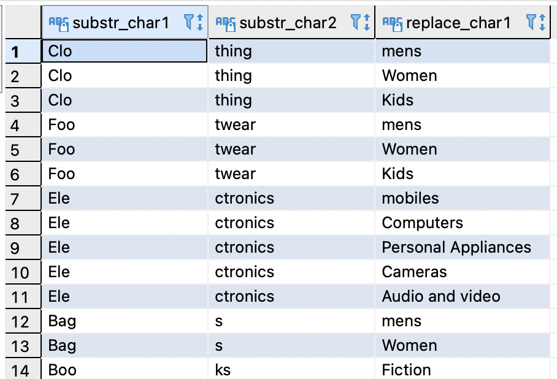
]

---

### 데이터 분석에서 많이 쓰이는 문자 함수

**LTRIM(char, set)** : char 문자열의 왼쪽부터 set 문자를 제거하여 반환

**RTRIM(char, set)** : char의 문자열의 오른쪽부터 set 문자를 제거하여 반환

**TRIM(LEADING, TRAILING, BOTH 'set' FROM CAHR)** : CHAR의 문자열 왼쪽, 오른쪽, 전체에서 set 문자를 제거하여 리턴

```sql
SELECT  LTRIM(A.PROD_CAT, 'C')		AS LTRIM1
    ,   RTRIM(A.PROD_CAT, 's')		AS RTRIM1
    ,   TRIM(LEADING 'C' FROM A.PROD_CAT)	AS TRIM_TO_LTRIM
    ,   TRIM(TRAILING 's' FROM A.PROD_CAT)	AS TRIM_TO_RTRIM
    ,   TRIM(BOTH 'H' FROM A.PROD_CAT)		AS BOTH_TRIM
    ,   REPLACE(A.PROD_CAT, ' ', '')		AS REMOVE_SPACE
FROM    PROD_CAT_INFO A;
```

[결과]
.left[
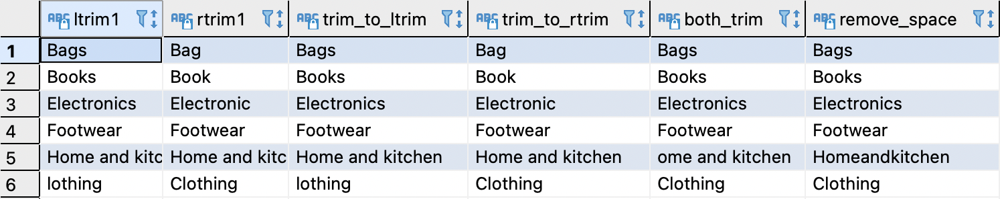
]

---

### 데이터 분석에서 많이 쓰이는 문자 함수

**LENGTH(char)** : char 문자열의 길이를 반환

**POSITION(search_string IN char)** : char의 문자열의 search_string 위치를 반환

```sql
SELECT  A.PROD_CAT
    ,   LENGTH(A.PROD_CAT)				 AS LEN_CHAR
    ,   POSITION('o' IN A.PROD_CAT)		AS POSITION_CHAR
FROM    PROD_CAT_INFO A;
```

[결과]
.left[
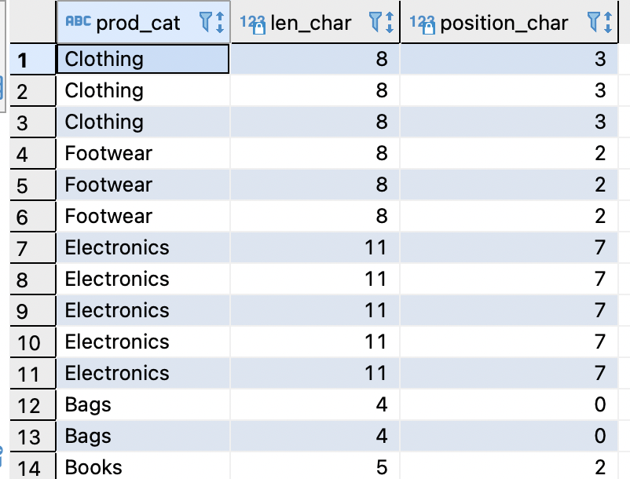
]

---

### 데이터 분석에서 많이 쓰이는 숫자 함수

**ABS(n)** : 숫자 n의 절대 값을 반환

**SIGN(n)** : 숫자 n의 부호를 반환 (n이 양수면 1, 음수면 -1, 0이면 0을 반환)

```sql
SELECT  A.CUSTOMER_ID
    ,   ABS(A.RATE)       AS ABS_N
    ,   SIGN(A.RATE)      AS SIGN_N
FROM    TRANSACTIONS A;
```

[결과]
.left[
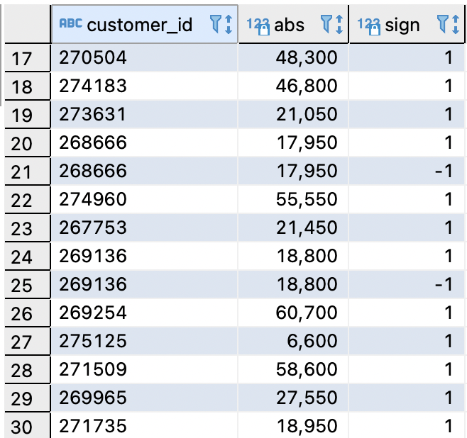
]

---

### 데이터 분석에서 많이 쓰이는 숫자 함수

**ROUND(n1, n2)** : 숫자 n1을 소수점 n2째 자리로 '반올림'하여 반환

**TRUNC(n1, n2)** : 숫자 n1을 소수점 n2째 자리로 '버림'하여 반환

```sql
SELECT  ROUND(123.5678, 2)        AS ROUND1
    ,   ROUND(123.5678, -2)       AS ROUND2
    ,   ROUND(123.5678)           AS ROUND3
    ,   TRUNC(123.5678, 2)        AS TRUNC1
    ,   TRUNC(123.5678, -2)       AS TRUNC2
    ,   TRUNC(123.5678)           AS TRUNC3
    ;
```

[결과]
.left[
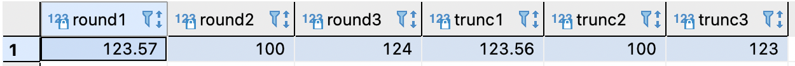
]

---

### 데이터 분석에서 많이 쓰이는 숫자 함수

**CEIL(n)** : 숫자 n보다 크거나 같은 최소의 정수 값을 반환

**FLOOR(n)** : 숫자 n보다 작거나 같은 최대의 정수 값을 반환

```sql
SELECT  CEIL(123.5678)        AS CEIL1
    ,   CEIL(-123.5678)       AS CEIL2
    ,   FLOOR(123.5678)       AS FLOOR1
    ,   FLOOR(-123.5678)      AS FLOOR2
    ;
```

[결과]
.left[
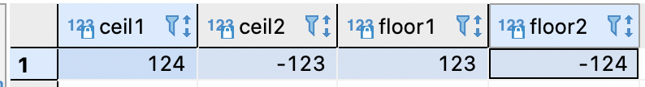
]

---

### 데이터 분석에서 많이 쓰이는 숫자 함수

**MOD(n1, n2)** : 숫자 n1을 n2로 나눈 나머지 값을 반환

**POWER(n1, n2)** : 숫자 n1의 n2 제곲 값을 반환

**SQRT(n)** : 숫자 n의 제곱근 값을 반환

```sql
SELECT  MOD(10, 3)        AS MOD1
    ,   MOD(10.5, 3)      AS MOD2
    ,   POWER(10, 3)      AS POWER1
    ,   SQRT(100)         AS SQRT1
    ;
```

[결과]
.left[
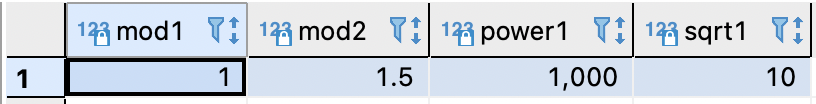
]

---

### 데이터 분석에서 많이 쓰이는 날짜 함수

**CURRENT_DATE** : 데이터베이스 서버의 현재 날짜 값을 반환

**CURRENT_TIME** : 데이터베이스 서버의 현재 시간(시:분:초) 값을 반환

**NOW()** : 데이터베이스 서버의 현재 날짜 및 시간(TIMESTAMP) 값을 반환

```sql
SELECT  CURRENT_DATE      AS DATE1
    ,   CURRENT_TIME      AS TIME1
    ,   NOW()             AS TIMESTAMP1
    ;
```

[결과]
.left[
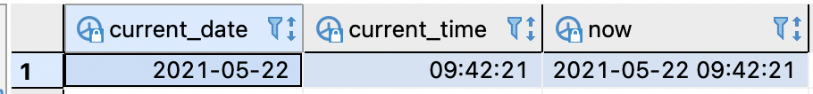
]

---

### 데이터 분석에서 많이 쓰이는 날짜 함수

**AGE(date1, date2)** : date1(현재)와 date2(과거) 간 나이를 계산하여 반환

**AGE(date)** : 데이터베이스 서버의 현재 date와 date 간 나이를 계산하여 반환

**EXTRACT(field from date)** : date 내 지정된 field 값을 추출하여 반환

```sql
SELECT  AGE(DATE '2021-12-31', DATE '1986-10-04')                     AS AGE1
    ,   AGE(DATE '1986-10-04')                                        AS AGE2
    ,   EXTRACT(YEAR FROM AGE(DATE '2021-12-31', DATE '1986-10-04'))  AS AGE_YEAR1
    ,   EXTRACT(YEAR FROM AGE(DATE '1986-10-04'))                     AS AGE_YEAR2
    ;
```

[결과]
.left[
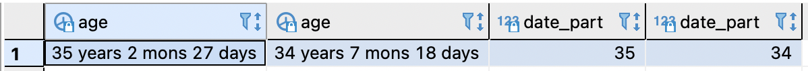
]

---

### 데이터 분석에서 많이 쓰이는 날짜 함수

**DATE +- 숫자** : DATE에 숫자만큼의 일수를 더하거나 뺀 결과를 반환

**DATE +- INTERVAL '단위** : DATE에 단위만큼을 더하거나 뺀 결과를 반환 (eg. '1 hour', '1 day', '12 month'...)

```sql
SELECT  DOB
    ,   DOB + 7                                   AS PLUS7DAYS
    ,   DOB - 7                                   AS MINUS7DAYS
    ,   DOB + INTERVAL '1 HOUR'                   AS PLUS1HOUR
    ,   DOB + INTERVAL '1 DAY'                    AS PLUS1DAYINTV
    ,   DOB + INTERVAL '12 MONTH'                 AS PLUS12MONTH
    ,   DOB + INTERVAL '2 WEEK'                   AS PLUS2WEEK
    ;
```

[결과]
.left[

]

---

### 데이터 분석에서 많이 쓰이는 날짜 함수

**DATE_TRUNC('단위', date)** : date를 단위 기준으로 버림한 값을 반환

**DATE_PART('단위', date)** : date의 해당 단위를 추출하여 반환

**EXTRACT(DOW FROM date)** : date의 요일을 반환 (0=일요일, 1=월요일, 2=화요일, ... 6=토요일)

```sql
SELECT  NOW()
    ,   DATE_TRUNC('MONTH', NOW())                AS TRUNCMONTH
    ,   DATE_TRUNC('MINUTE', NOW())               AS TRUNCMINUTE
    ,   DATE_PART('HOUR', NOW())                  AS HOURPART
    ,   EXTRACT(DOW FROM NOW())                   AS DOW -- 0=SUNDAY, 1=MONDAY, 2=TUESDAY, ... 6=SATURDAY
    ;
```

[결과]
.left[
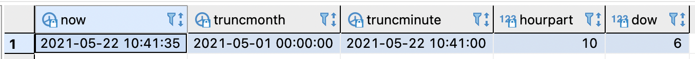
]

---

### 데이터 분석에서 많이 쓰이는 변환 함수

**TO_CHAR(n, 'format')** : 숫자 n을 주어진 'format' 형식의 문자 값으로 변환하여 반환

**TO_CHAR(DATE, 'format')** : 날짜 DATE를 주어진 'format' 형식의 문자 값으로 변환하여 반환
<br>(format이 YYYY:연도, MM:월, DD:일자, HH24:시간, MI:분, SS:초, DAY:요일)


```sql
SELECT  TO_CHAR(123456.789, '999,999.99')                     AS TOCHAR1
    ,   TO_CHAR(123456.789, '999,999,999')                    AS TOCHAR2
    ,   TO_CHAR(DATE '2021-06-17', 'YYYY-MM')                 AS TOCHAR3
    ,   TO_CHAR(DATE '2021-06-17', 'YYYY/MM/DD HH24:MI:SS')   AS TOCHAR4
    ,   TO_CHAR(DATE '2021-06-17', 'DAY')                     AS TOCHAR5
    ;
```

[결과]
.left[
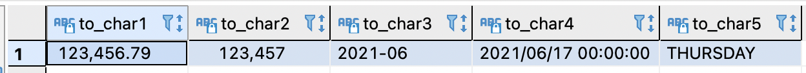
]

---

### 데이터 분석에서 많이 쓰이는 변환 함수

**TO_DATE(char, 'format')** : 문자열 char를 주어진 'format' 형식의 날짜로 변환하여 반환

**TO_TIMESTAMP(char, 'format')** : 문자열 char를 주어진 'format' 형식의 timestamp로 변환하여 반환

```sql
SELECT  TO_DATE('2021-06-17', 'YYYY-MM-DD')                     AS TODATE1
    ,   TO_TIMESTAMP('20210617163030', 'YYYYMMDDHH24MISS')      AS TOTIMESTAMP1
    ;
```

[결과]
.left[
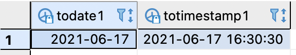
]

---

### 데이터 분석에서 많이 쓰이는 변환 함수

**CAST(expr AS type)** : expr을 type 데이터 타입으로 변환하여 반환


```sql
SELECT  CAST(123456.789		AS VARCHAR(10))                AS CAST1
    ,   CAST(DATE '2021-06-17'	AS VARCHAR(14))             AS CAST2
    ,   CAST('123456.789'	AS NUMERIC(9, 3))                AS CAST3
    ,   CAST('2021-06-17'	AS DATE)                         AS CAST4
    ,   CAST('2021-06-17'	AS TIMESTAMP)                    AS CAST5
    ;
```

[결과]
.left[
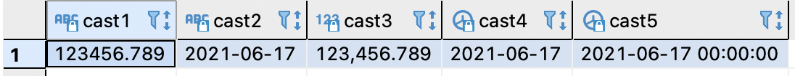
]

---

### 데이터 분석에서 많이 쓰이는 NULL 관련 함수

**COALESCE(expr1, expr2)** : expr1이 null이면 expr2 대체값을 반환

**NULLIF(expr1, expr2)** : expr1과 expr2가 같으면 null을 반환 그렇지 않으면 expr1 반환


```sql
SELECT  COALESCE('AAA', 'BBB')    AS COALESCE1
    ,   COALESCE(NULL, 'BBB')     AS COALESCE2
    ,   COALESCE(NULL, 0)         AS COALESCE3
    ,   NULLIF('AAA', 'BBB')      AS NULLIF1
    ,   NULLIF('AAA', 'AAA')      AS NULLIF2
    ,   NULLIF(12/3, 2*2)         AS NULLIF3
    ;
```

[결과]
.left[
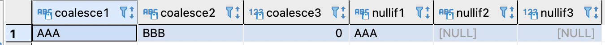
]

---

### CASE 표현식

- #### CASE 표현식을 이용하면 비교 값 또는 조건에 따라 데이터를 가공하거나 변환할 수 있다.

- #### 프로그래밍 언어의 조건문 (IF - ELSE IF - ELSE)과 유사한 처리가 가능하다

.center[]

.pull-left[

```sql
SELECT  A.CUSTOMER_ID
    ,   A.STORE_TYPE
    ,   CASE WHEN A.STORE_TYPE IN ('OnlineShop', 'Homeshopping')
             THEN 'ON'
             ELSE 'OFF'   END       AS TYPE_GB
FROM    TRANSACTIONS A;
```

]

.pull-right[

.center[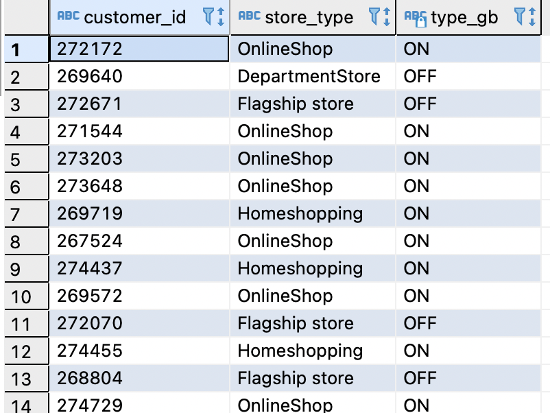]

]

---
class: inverse center middle

# 데이터 그룹화와 집계<br>(GROUP BY절)

---

### GROUP BY절

- #### SELECT 문에 GROUP BY 절을 사용하면 데이터를 그룹화(Grouping) 할 수 있다.
- #### GROUP BY 절에는 GROUPING 기준이 될 컬럼 또는 표현식을 콤마(,)로 구분하여 기술한다.

```sql
SELECT  컬럼
    ,   컬럼
FROM    조건
GROUP BY 컬럼, 컬럼;
```

- #### GROUP BY절은 GROUPING 컬럼/표현식 들의 값이 같은 행들로 행 그룹(group of rows)을 생성하고,<br>각 행 그룹당 1개의 행으로 그룹화(Grouping)한다.

  -ex. STORE_TYPE 컬럼의 값들로 행 그룹이 생성되고, 이는 최종적으로 1개의 행으로 그룹화되어 조회된다. 

---

### GROUP BY절

```sql
SELECT  A.STORE_TYPE
    ,   SUM(A.TOTAL_AMT)                AS AMT
    ,   COUNT(DISTINCT A.CUSTOMER_ID)   AS CNT_CUST
FROM    TRANSACTIONS A
GROUP BY    A.STORE_TYPE;
```

.pull-left[
**[GROUP BY 전 데이터]**<br>
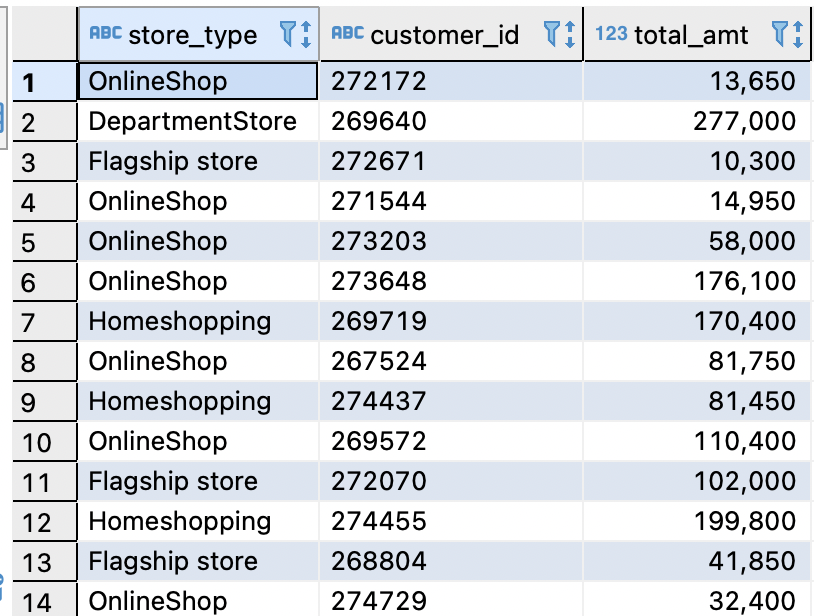

]

.pull-right[

**[GROUP BY 후 데이터]**


]

---

### GROUP BY절

- #### SELECT문에 GROUP BY절이 포함될 때, GROUPING 컬럼/표현식 외에 다른 컬럼을 SELECT절에 기술하면 오류가 발생한다.

.pull-left[

* GROUPING 컬럼 조회 예시

```sql
SELECT  A.STORE_TYPE
    ,   A.PROD_CAT_CODE
FROM    TRANSACTIONS A
GROUP BY  A.STORE_TYPE
    ,     A.PROD_CAT_CODE
```

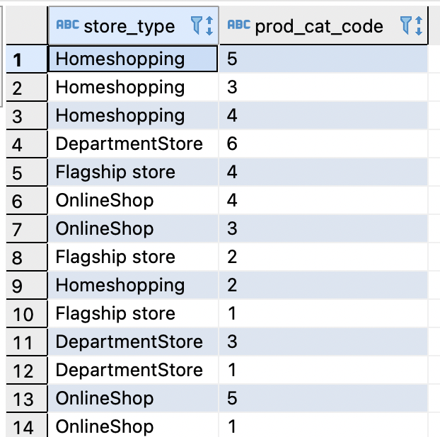

]

.pull-right[

* 오류 발생 예시

```sql
SELECT  A.STORE_TYPE
    ,   A.PROD_CAT_CODE
    ,   A.TOTAL_AMT
FROM    A.STORE_TYPE
    ,   A.PROD_CAT_CODE
```

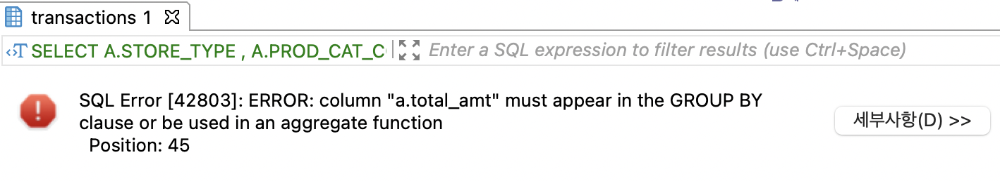

]

---

### 집계 함수 (Aggregate Functions)

- #### 집계 함수는 다중 행(행 그룹)의 값을 입력 받아 단일 행의 값을 반환하는 함수이다.
 -기본적인 집계 함수로는 **COUNT**, **SUM**, **AVG**, **MAX**, **MIN**, **MEDIAN** 등이 있다.
 
- #### 집계 함수 사용 예제

```sql
SELECT  A.STORE_TYPE
    ,   COUNT(*)            AS CNT
    ,   SUM(A.TOTAL_AMT)    AS SUM_AMT
    ,   AVG(A.TOTAL_AMT)    AS MEAN_AMT
    ,   MAX(A.TOTAL_AMT)    AS MAX_AMT
FROM    TRANSACTIONS A
GROUP BY    A.STORE_TYPE;
```

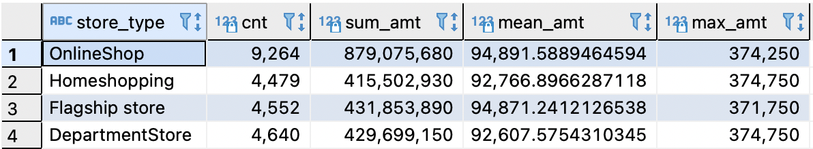

---

### 집계 함수 (Aggregate Functions)

- #### 집계 함수를 사용하면 행 그룹별로 <u>NULL을 제외한 값</u>들이 집계된다.

- #### 집계 함수의 인자에 연산이나 가공이 존재하면, 이는 집계 함수 실행 전에 행 그룹 내에 있는 개별행 단위로 수행된다.

- #### GROUP BY 절 없이 SELECT절에 집계 함수가 사용되면, <u>전체 행이 하나의 행 그룹이 된다.</u>

```sql
SELECT  COUNT(*)            AS CNT
    ,   SUM(A.TOTAL_AMT)    AS SUM_AMT
FROM    TRANSACTIONS A;
```

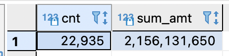

---

### 집계 함수(Aggregate Functions)

**COUNT(*)** : 행 그룹에 속한 전체 행의 개수를 반환

**COUNT(expr)** : 행 그룹에 속한 NULL이 아닌 expr(표현식)의 개수를 리턴


```sql
SELECT  A.STORE_TYPE
    ,   COUNT(*)                          AS CNT
    ,   COUNT(A.CUSTOMER_ID)              AS CNT_CUST_ID
    ,   COUNT(DISTINCT A.CUSTOMER_ID)     AS CNT_DISTINCT_CUST_ID
FROM    TRANSACTIONS A
GROUP BY 1 -- 컬럼명 대신 컬럼 위치 표기 가능
;
```

[결과]
.left[
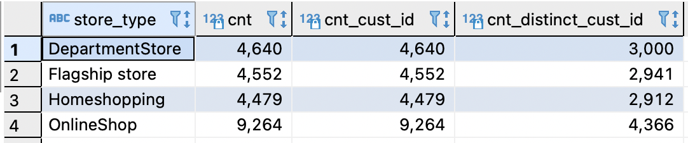
]

---

### 집계 함수(Aggregate Functions)

**SUM(expr)** : 행 그룹에 속한 NULL이 아닌 expr(표현식)의 합계 값을 반환

**AVG(expr)** : 행 그룹에 속한 NULL이 아닌 expr(표현식)의 평균 값을 반환

```sql
SELECT  A.STORE_TYPE
    ,   SUM(A.QTY)                   AS SUM_QTY
    ,   AVG(A.QTY)                   AS AVG_QTY
    ,   AVG(A.DISCOUNT)              AS AVG_DISC
    ,   AVG(COALESCE(A.DISCOUNT, 0)) AS COAL_AVG_DISC
FROM    TRANSACTIONS A
GROUP BY 1 -- 컬럼명 대신 컬럼 위치 표기 가능
;
```

[결과]
.left[
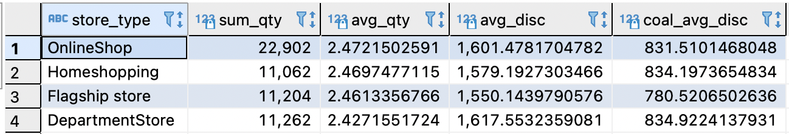
]

---

### 집계 함수(Aggregate Functions)

**MAX(expr)** : 행 그룹에 속한 NULL이 아닌 expr(표현식)의 최대 값을 반환

**MIN(expr)** : 행 그룹에 속한 NULL이 아닌 expr(표현식)의 최소 값을 반환

```sql
SELECT  A.STORE_TYPE
    ,   MAX(A.QTY)                  AS MAX_QTY
    ,   MIN(A.QTY)                  AS MIN_QTY
    ,   MAX(A.TRAN_DATE)            AS MAX_DATE
    ,   MIN(A.TRAN_DATE)            AS MIN_DATE
FROM    TRANSACTIONS A
GROUP BY 1 -- 컬럼명 대신 컬럼 위치 표기 가능
;
```

[결과]
.left[
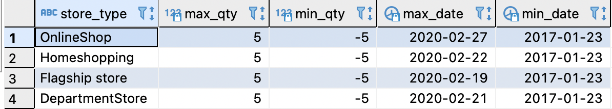
]

---

### 집계 함수(Aggregate Functions)

**VARIANCE(expr)** : 행 그룹에 속한 NULL이 아닌 expr(표현식)의 분산 값을 반환

**STDDEV(expr)** : 행 그룹에 속한 NULL이 아닌 expr(표현식)의 표준편차 값을 반환

```sql
SELECT  A.STORE_TYPE
    ,   VARIANCE(A.TOTAL_AMT)       AS VAR_AMT
    ,   STDDEV(A.TOTAL_AMT)         AS STD_AMT
FROM    TRANSACTIONS A
GROUP BY 1 -- 컬럼명 대신 컬럼 위치 표기 가능
;
```

[결과]
.left[
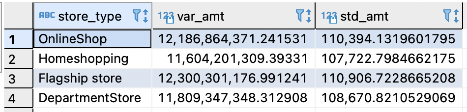
]

---

### 집계 함수(Aggregate Functions)

**PERCENTILE_DISC(0.5) WITHIN GROUP (ORDER BY expr)** : 행 그룹에 속한 NULL이 아닌 expr(표현식)의 중앙 값을 반환

**MODE() WITHIN GROUP (ORDER BY expr)** : 행 그룹에 속한 NULL이 아닌 expr(표현식)의 최빈 값을 반환

```sql
SELECT	STORE_TYPE
	,	PERCENTILE_DISC(0.5) WITHIN GROUP (ORDER BY TOTAL_AMT)	AS MEDIAN_AMT
	,	PERCENTILE_DISC(0.5) WITHIN GROUP (ORDER BY	TRAN_DATE)	AS MEDIAN_DATE
	,	MODE() WITHIN GROUP (ORDER BY TOTAL_AMT)	AS MODE_AMT
	,	MODE() WITHIN GROUP (ORDER BY TRAN_DATE)	AS MODE_DATE
FROM	TRANSACTIONS
;
```

[결과]
.left[
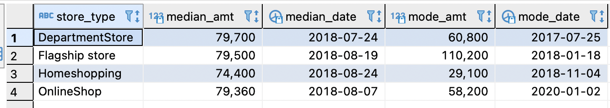
]

---

### 집계 함수(Aggregate Functions)

- #### CASE 표현식과 집계 함수를 사용하여 데이터를 PIVOT(회전) 시켜 조회할 수 있다.

.pull-left[

[집계 값을 "행"으로 표시]
```sql
SELECT      A.STORE_TYPE
    ,       SUM(A.TOTAL_AMT)    AS AMT
FROM        TRANSACTIONS A
GROUP BY    1
ORDER BY    1;
```

.left[
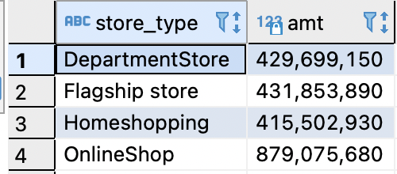
]

]

.pull-right[

[집계 값을 "열"로 표시]
```sql
SELECT  SUM(CASE WHEN A.STORE_TYPE = 'DepartmentStore' THEN A.TOTAL_AMT END)    AS DEP_AMT
    ,   SUM(CASE WHEN A.STORE_TYPE = 'Flagship store' THEN A.TOTAL_AMT END)     AS FLG_AMT
    ,   SUM(CASE WHEN A.STORE_TYPE = 'Homeshopping' THEN A.TOTAL_AMT END)       AS HOS_AMT
    ,   SUM(CASE WHEN A.STORE_TYPE = 'OnlineShop' THEN A.TOTAL_AMT END)         AS ONS_AMT
FROM    TRANSACTIONS A;       
```

.left[
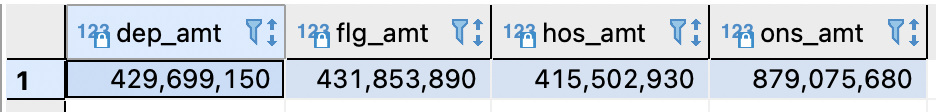
]

]

---

### HAVING절

- #### HAVING절을 사용하여 조회되는 행 그룹을 제한할 수 있다.
- #### HAVING절에는 행 그룹을 제한하기 위한 조건을 기술한다.
 -조건은 **각 행 그룹마다 평가**되며 TRUE, FALSE, UNKNOWN 중 하나를 반환한다.<br>
 -조건의 결과가 TRUE인 행 그룹만 결과 집합에 포함된다.
 
 ```sql
 SELECT   컬럼, 컬럼 ...
 FROM     테이블
 WHERE    조건
 GROUP BY 컬럼, 컬럼...
 HAVING   조건
 ;
 ```

- #### HAVING절에는 주로 집계 값에 대한 조건(비교 조건, IS NULL 조건 등)이 기술된다.

---

### HAVING절

- #### WHERE절은 행 그룹이 생성되기 전에 조건에 따라 행을 제한하고,
- #### HAVING절은 행 그룹이 생성된 후에 조건에 따라 행 그룹을 제한한다.

.pull-left[

[WHERE절, HAVING절 사용 예제]
```sql
SELECT  A.STORE_TYPE
    ,   COUNT(A.TRANSACTIONS_ID)    AS CNT_TR_ID
    ,   ROUND(AVG(A.TOTAL_AMT))     AS AVG_TOTAL_AMT
FROM    TRANSACTIONS A
WHERE   A.DISCOUNT IS NOT NULL
GROUP BY 1
HAVING  COUNT(A.TRANSACTIONS_ID) < 4000
AND     ROUND(AVG(A.TOTAL_AMT)) >= 91000;
```
[결과]
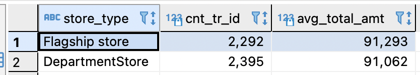
]

.pull-right[
[참고]  

**WHERE절 조건, HAVING절 조건이 없을 경우**
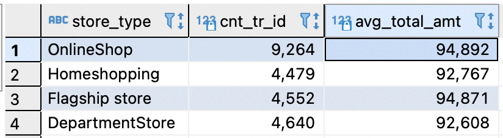

**HAVING절 조건이 없을 경우**  
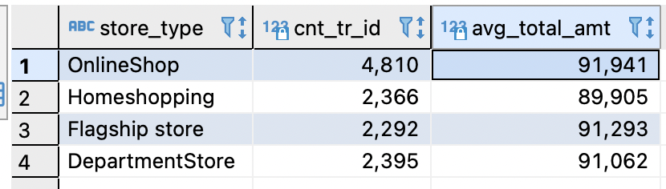


]

---

### 연습문제

#### 1. 고객(customer) 테이블에서 1986년 이후(1986년 포함) 출생한 고객을 조회하세요.

#### 2. 고객(customer) 테이블에서 여성 고객 중 city 코드 5에 거주하는 고객을 조회하세요.

#### 3. 거래(transactions) 테이블에서 2017년도부터 2018년도까지 'Flasship store'에서 거래된 내역을 조회하세요.

#### 4. 거래(transactions) 테이블에서 'store_type' 컬럼의 값을 모두 소문자로 변환하여 조회하세요.

#### 5. 카테고리 정보(prod_cat_info) 테이블에서 서브 카테고리명에 'men'이 들어간 행을 조회하세요.

#### 6. 카테고리 정보(prod_cat_info) 테이블에서 서브 카테고리명이 다섯 글자인 행을 조회하세요.

#### 7. 고객(customer) 테이블에서 '2021-06-30'을 기준으로 고객id, 고객 성별, 고객 생년월일, 연령을 조회하세요.

#### 8. 고객(customer) 테이블에서 현재 시스템을 기준으로 각 연령별 고객수를 구하세요.

#### 9. 거래(transactions) 테이블에서 'store_type'을 기준으로 각 연도별 'total_amt'를 집게하세요.

#### 10. 거래(transactions) 테이블에서 'store_type'을 2018년도의 요일별 'total_amt'를 집계하세요. 

---

### 연습문제

#### 11. 월별 구매 고객수와 매출액 합계를 구한 후, 과거 순부터 정렬하세요.

#### 12. 거래(transactions) 테이블에서 판매가격에서 할인금액을 뺀 컬럼을 추가하세요. 단, 결과가 NULL이 나오지 않도록 조회하세요.

#### 13. 채널별 구매 고객수, 거래수, 구매수량, 매출액을 집계하세요. 단, 채널별 구분은 온라인 채널(OnlieShop, Homeshopping)<br>&emsp;오프라인 채널(DepartmentStore, Flagship store)로 구분하세요.

#### 14. 스토어 유형별로 객단가(=매출액/구매고객수)를 구하세요.

#### 15. 거래 테이블에서 prod_cat_code와 prod_sub_cat_code를 연결하여 구매 고객수를 집계 후 prod_cat_code 순으로 정렬하세요.

#### 16. prod_cat_code 단위별로 매출액 합계를 행이 아닌 열로 조회하세요.

#### 17. 매출액이 (-)인 행은 '취소'로 (+)인 행은 '정상'으로 표기하는 컬럼을 추가하세요.

#### 18. 서브 카테고리 코드 단위로 매출액이 1억원 이상인 서브 카테고리만 조회하세요.

#### 19. 매출액이 (-)인 행을 제외한 후 할인액 합계를 스토어유형별로 집계하세요.

#### 20. 고객별로 첫 구매일과 마지막 구매일을 구한 후 마지막 구매일과 첫 구매일의 차이를 구하세요.

---
class: inverse center middle

# 조인<br>(JOIN)

---

### 조인(JOIN)

* #### 조인 문법을 사용하면 여러 테이블에 저장되어 있는 데이터를 함께 조회할 수 있다.
  -관계형 데이터베이스는 정규화에 의해 여러 테이블에 데이터가 나뉘어 저장되어 있어서,이들을 함께 조회하기 위해서 조인이 필요하다. 

* #### 조인은 두 테이블 간에 특정 컬럼(들)의 값을 비교하여, 비교 결과가 TRUE인 행들을 연결시킨다.
  -**FROM절**에는 조인할 테이블과 JOIN TYPE(조인 유형)을 기술한다.<br>
  
  -**ON**절에는 조인 조건을 기술한다.
  
```sql
SELECT    A.컬럼
      ,   B.컬럼
FROM    테이블 A
JOIN TYPE
        테이블 B
ON      (조인 조건)
WHERE   일반 조건;
```

---

### 조인의 종류 - INNER JOIN

.pull-left[


#### FROM 절에 조인 유형으로 INNER JOIN 또는 JOIN을 기술한다.

```sql
SELECT  A.PROD_CAT_CODE
    ,   B.PROD_CAT
FROM    TRANSACTIONS A
INNER JOIN
        PROD_CAT_INFO B
ON      A.PROD_CAT_CODE = B.PROD_CAT_CODE;
```
]

.pull-right[

**[조인 결과]**

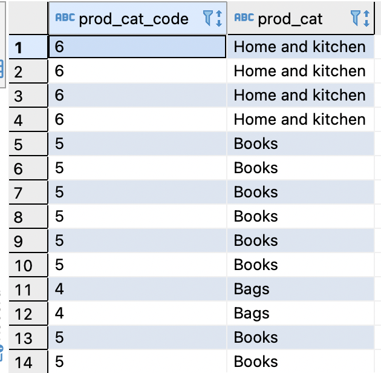

]

---

### 조인의 종류 - LEFT OUTER JOIN

.pull-left[


#### FROM 절에 조인 유형으로 LEFT OUTER JOIN 또는<BR> LEFT JOIN을 기술한다.

```sql
SELECT    A.CUSTOMER_ID
    ,     B.CUSTOMER_ID
    ,     B.TRAN_DATE
FROM      CUSTOMER A
LEFT OUTER JOIN
          TRANSACTIONS B
ON        A.CUSTOMER_ID = B.CUSTOMER_ID
ORDER BY  2 NULLS FIRST;
```
]

.pull-right[

**[조인 결과]**

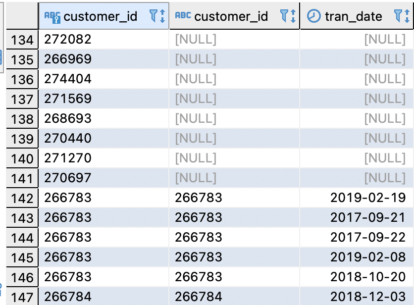

]

---

### 조인의 종류 - RIGHT OUTER JOIN

.pull-left[


#### FROM 절에 조인 유형으로 RIGHT OUTER JOIN 또는<BR> RIGHT JOIN을 기술한다.

```sql
SELECT    A.CUSTOMER_ID
    ,     B.CUSTOMER_ID
    ,     B.TRAN_DATE
FROM      TRANSACTIONS A
RIGHT OUTER JOIN
          CUSTOMER B
ON        A.CUSTOMER_ID = B.CUSTOMER_ID
ORDER BY  1 NULLS FIRST;
```
]

.pull-right[

**[조인 결과]**

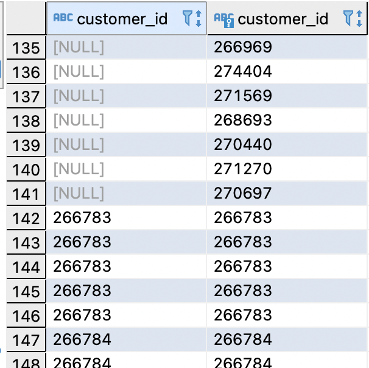

]

---

### 조인의 종류 - FULL OUTER JOIN

.pull-left[


#### FROM 절에 조인 유형으로 FULL OUTER JOIN 또는<BR> FULL JOIN을 기술한다.

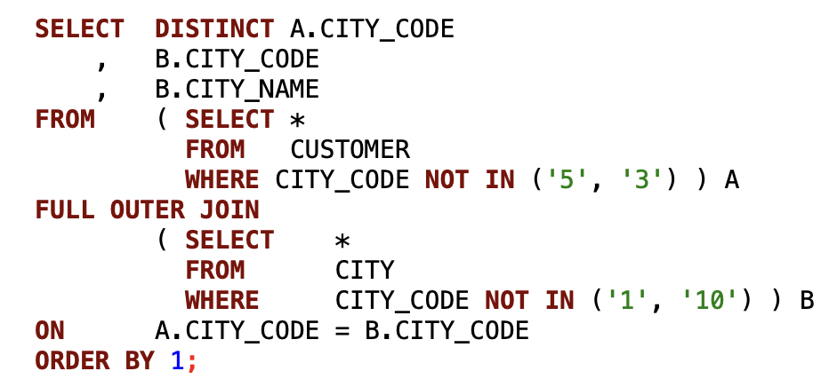

]

.pull-right[

**[조인 결과]**

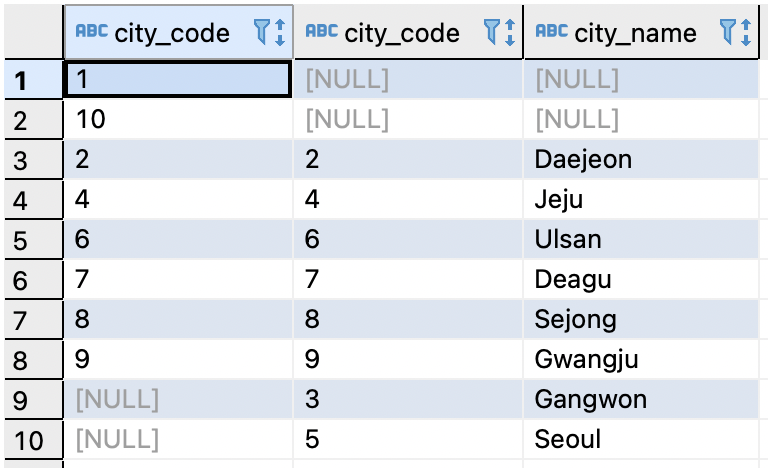

]

---

## 연습문제

### 1. 고객(customer) 테이블에 CITY명을 JOIN하여 컬럼을 추가하세요

### 2. 거래(transactions) 테이블에 카테고리, 서브카테고리명을 JOIN하여<br>&emsp;컬럼을 추가하세요.

--

.pull-left[

[1번 문제]
```sql
SELECT  A.*
    ,   C.CITY_NAME
FROM    CUSTOMER A
INNER JOIN
        CITY C
ON      A.CITY_CODE = C.CITY_CODE;
```

]

--

.pull-right[

[2번 문제]
```sql
SELECT    T.*
    ,     P.PROD_CAT
    ,     P.PROD_SUB_CAT
FROM      TRANSACTIONS T
INNER JOIN
          PROD_CAT_INFO P
ON        T.PROD_CAT_CODE = P.PROD_CAT_CODE
AND       T.PORD_SUB_CAT_CODE = P.PROD_SUB_CAT_CODE;
```

]

---

### 집합 연산자

.left[

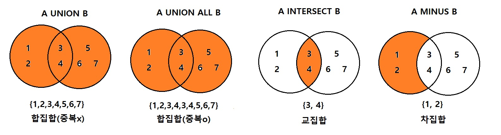

]

#### * UNION : 쿼리 결과 집합들 간의 합집합을 반환하는 연산자이다. (중복 행이 제거된 결과를 반환)

#### * UNION ALL : 쿼리 결과 집합들 간의 합집합을 반환하는 연산자이다. (중복된 행을 제거하지 않는다)

#### * INTERSECT : 쿼리 결과 집합들 간의 교집합을 반환하는 연산자이다. (중복 행이 제거된 결과를 반환)

#### * MINUS(EXCEPT) : 쿼리 결과 집합들 간의 차집합을 반환하는 연산자이다. (중복 행이 제거된 결과를 반환한다)

---

### 집합 연산자 - UNION/UNION ALL

.pull-left[

**[UNION]**
```sql
SELECT  A.CITY_CODE
FROM    CUSTOMER A
UNION
SELECT  B.CITY_CODE
FROM    CITY B;
```

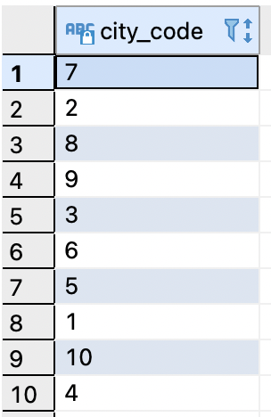

]

.pull-right[

**[UNION ALL]**
```sql
SELECT  A.CITY_CODE
FROM    CUSTOMER A
UNION ALL
SELECT  B.CITY_CODE
FROM    CITY B;
```
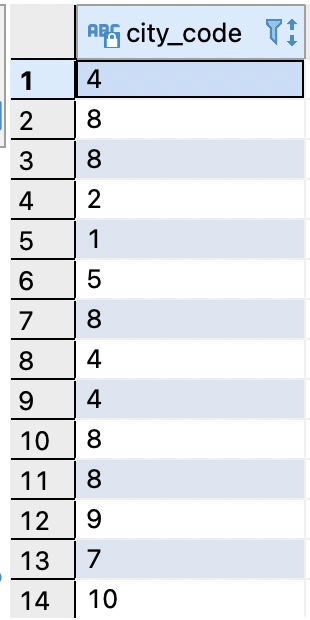

]

---

### 집합 연산자 - INTERSECT/MINUS(EXCEPT)

.pull-left[

**[INTERSECT]**
```sql
SELECT  A.CITY_CODE
FROM    CUSTOMER A
WHERE   A.CITY_CODE IN ('1', '3', '5', '7', '9')
UNION
SELECT  B.CITY_CODE
FROM    CITY B
WHERE   B.CITY_CODE IN ('1', '4', '5', '9', '10');
```

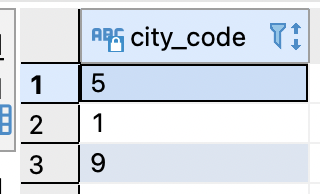

]

.pull-right[

**[MINUS(EXCEPT)]**
```sql
SELECT  A.CITY_CODE
FROM    CUSTOMER A
WHERE   A.CITY_CODE IN ('1', '3', '5', '7', '9')
EXCEPT
SELECT  B.CITY_CODE
FROM    CITY B
WHERE   B.CITY_CODE IN ('1', '4', '5', '9', '10');
```
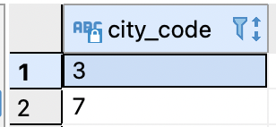

]

*postgresSQL에서는 MINUS 연산자 대신 EXCEPT 연산자를 사용한다.