```{r setup, include=FALSE}
options(htmltools.dir.version = FALSE)
knitr::opts_chunk$set(
  fig.width=9, fig.height=3.5, fig.retina=3,
  out.width = "100%",
  cache = FALSE,
  echo = TRUE,
  message = FALSE, 
  warning = FALSE,
  fig.show = TRUE,
  hiline = TRUE
)
```

```{r xaringan-themer, include=FALSE, warning=FALSE}
library(xaringanthemer)
style_mono_light(
  base_color = "#23395b",
  header_font_google = google_font("Do+Hyeon"),
  text_font_google   = google_font("Jua", "300", "300i"),
  code_font_google   = google_font("Fira Mono"),
  colors = c(
  red = "#f34213",
  purple = "#3e2f5b",
  orange = "#ff8811",
  green = "#136f63",
  white = "#FFFFFF",
  blue = '#0000FF',
  yellow = '#ffdd00'
)
)
```

### 서브 쿼리(Subquery)

* 하나의 SQL 문 내에 포함된 또 다른 SQL문을 '서브 쿼리'라고 한다.

```sql
SELECT  A.컬럼
    ,   B.컬럼
FROM    테이블 A
JOIN    테이블 B ON A.COL = B.COL
WHERE   조건 ( SELECT X.컬럼
               FROM   테이블 X
               [WHERE / GROUP BY / HAVING])
```

### 서브쿼리의 종류

- **중첩 서브 쿼리(Nested Subquery)** : WHERE절이나 HAVING절에서 조건으로 사용되는 서브 쿼리

- **스칼라 서브 쿼리(Scalar Subquery)** : SELECT절에서 사용되며 단일 값을 반환하는 서브 쿼리 

- **인라인 뷰(Inline View)** : FROM절에서 조회 대상 집합으로 사용되는 서브 쿼리

---

### 서브 쿼리 사용 예시

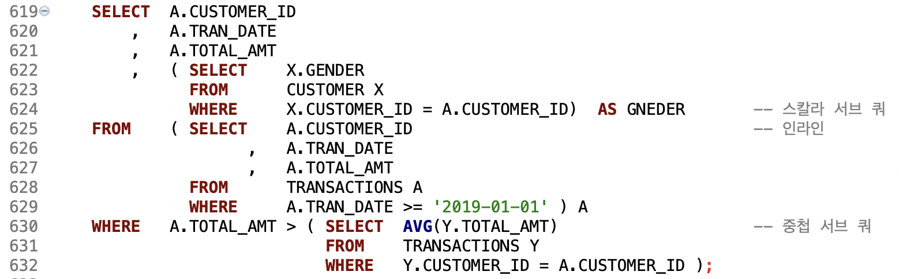

**[결과]**<br>
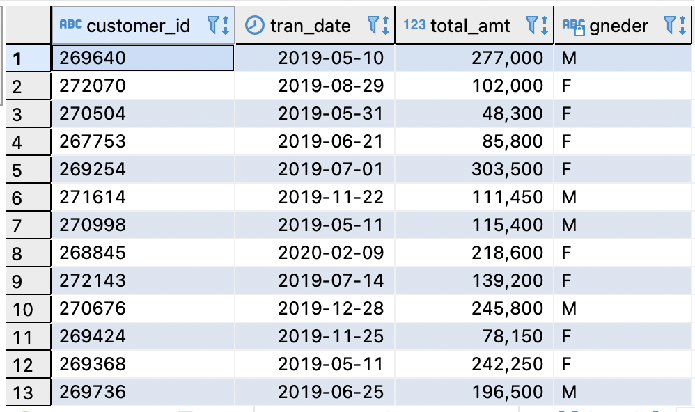

---

### 중첩 서브 쿼리

#### 단일 행 중첩 서브 쿼리

- 서브 쿼리가 단일 행을 반환하는 서브쿼리를 의미. .red[(서브 쿼리 결과가 2건 이상이면 오류 발생)]

- 단일 값 비교 조건 (=, <, >, <=, >=, <> 등)과 함께 사용된다.

.pull-left[

```sql
SELECT  A.CUSTOMER_ID
    ,   A.TRAN_DATE
    ,   A.PROD_CAT_CODE
    ,   A.TOTAL_AMT
FROM    TRANSACTIONS A
WHERE   A.PROD_CAT_CODE = ( SELECT  DISTINCT X.PROD_CAT_CODE
                            FROM    PROD_CAT_INFO X
                            WHERE   X.PROD_CAT = 'Footwear');
```

]

.pull-right[

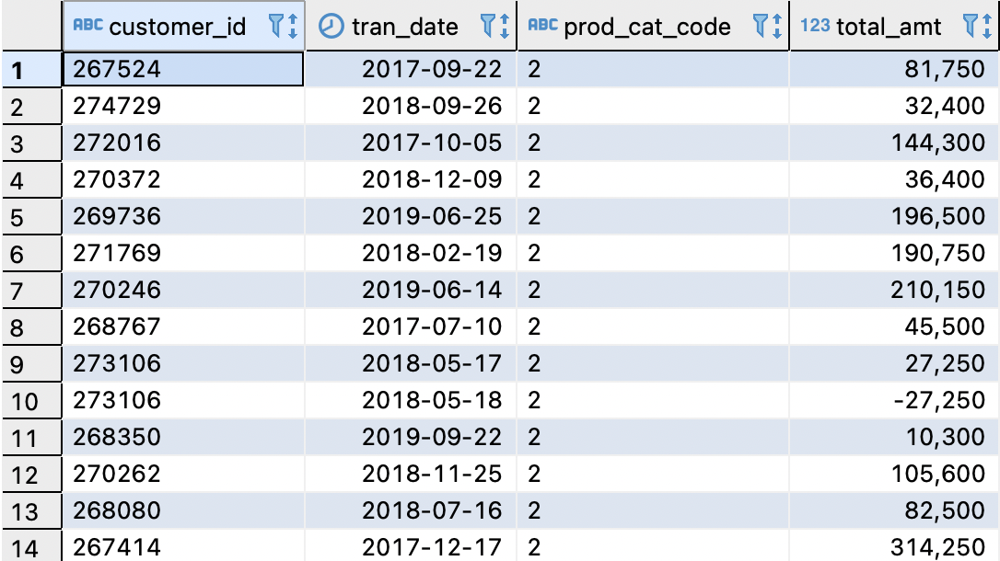

]

---

### 중첩 서브 쿼리

#### 다중 행 중첩 서브 쿼리

- 서브 쿼리가 다중 행을 반환하는 서브쿼리를 의미.

- 다중 값 비교 조건인 IN 조건과 함께 사용된다.

.pull-left[

```sql
SELECT  A.CUSTOMER_ID
    ,   A.TRAN_DATE
    ,   A.PROD_CAT_CODE
    ,   A.TOTAL_AMT
FROM    TRANSACTIONS A
WHERE   A.CUSTOMER_ID IN ( SELECT  X.CUSTOMER_ID
                           FROM    CUSTOMER X
                           WHERE   X.DOB > '1990-01-01');
```

]

.pull-right[

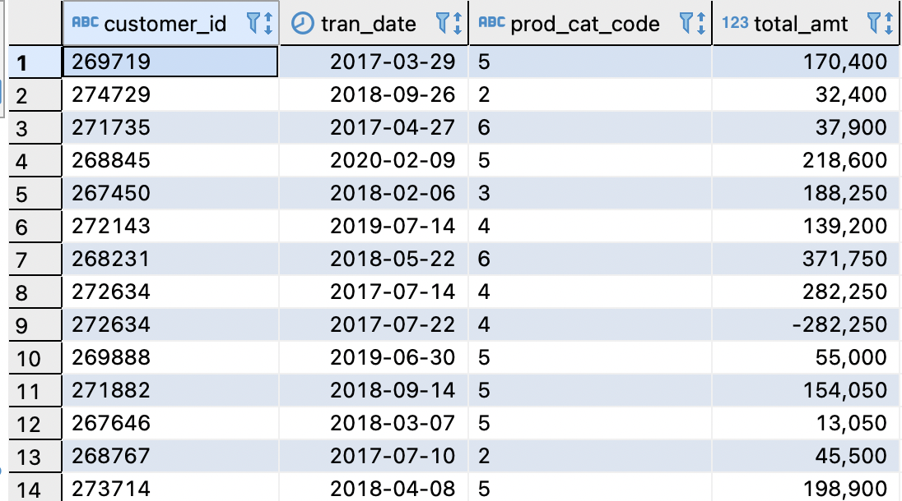

]

---

### 중첩 서브 쿼리

#### 상관 서브 쿼리(Correlated Subquery)

- 상관 서브쿼리는 메인 쿼리의 컬럼을 참조하여 수행되는 서브 쿼리이다.

- 메인 쿼리의 각 행을 평가할 때마다 서브 쿼리의 결과가 달라질 수 있다.

.pull-left[

```sql
SELECT  A.CUSTOMER_ID
    ,   A.TRAN_DATE
    ,   A.PROD_CAT_CODE
    ,   A.TOTAL_AMT
FROM    TRANSACTIONS A
WHERE   A.TOTAL_AMT IN ( SELECT  AVG(X.TOTAL_AMT)
                         FROM    TRANSACTIONS X
                         WHERE   X.PROD_CAT_CODE = A.PROD_CAT_CODE);
```

]

.pull-right[

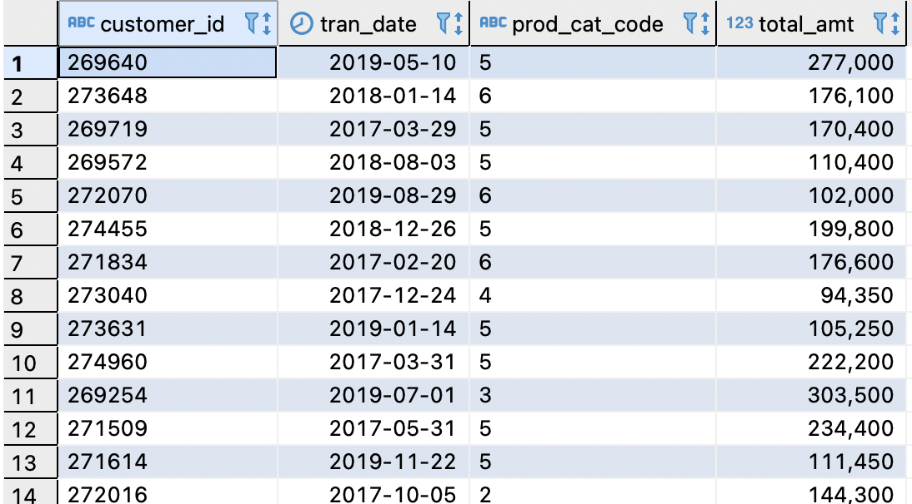

]

---

### 스칼라 서브 쿼리

* #### SELECT 절에서 사용되며 .blue[단일 값]을 반환하는 서브 쿼리이다.
 - 메인 집합의 **<u>각 행마다 실행되어 단일 값(1 row, 1 column)을 반환</u>**하는 상관 서브쿼리이다.


.pull-left[

```sql
SELECT  A.CUSTOMER_ID
    ,   A.DOB
    ,   A.GENDER
    ,   A.CITY_CODE
    ,   ( SELECT X.CITY_NAME
          FROM   CITY X
          WHERE  X.CITY_CODE = A.CITY_CODE )    AS CITY_NAME
FROM    CUSTOMER A
WHERE   A.DOB > '1990-01-01';
```

]

.pull-right[

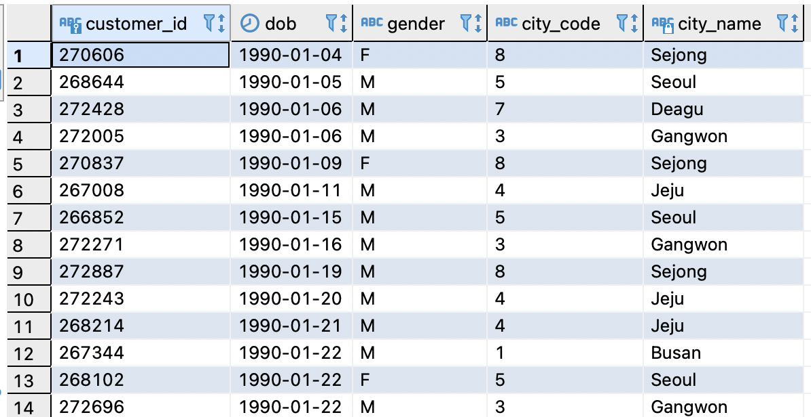

]

---

### 스칼라 서브 쿼리

* #### 메인 집합의 결과 건수는 스칼라 서브 쿼리에 의해 변경되지 않는다.
 - 스칼라 서브 쿼리의 결과가 2건 이상이면 오류가 발생하고, **<u>0건이면 NULL을 반환한다</u>**.


.pull-left[

```sql
SELECT  A.CUSTOMER_ID
    ,   A.TRAN_DATE
    ,   A.PROD_CAT_CODE
    ,   A.TOTAL_AMT
    ,   ( SELECT ROUND(AVG(X.TOTAL_AMT))
          FROM   TRANSACTIONS X
          WHERE  X.PROD_CAT_CODE = A.PROD_CAT_CODE
          AND    X.PROD_CAT_CODE IN ('1', '2', '3', '4', '5'))    AS CAT_AVG_AMT
FROM    TRANSACTIONS A
WHERE   A.TOTAL_AMT > 50000;
```

]

.pull-right[

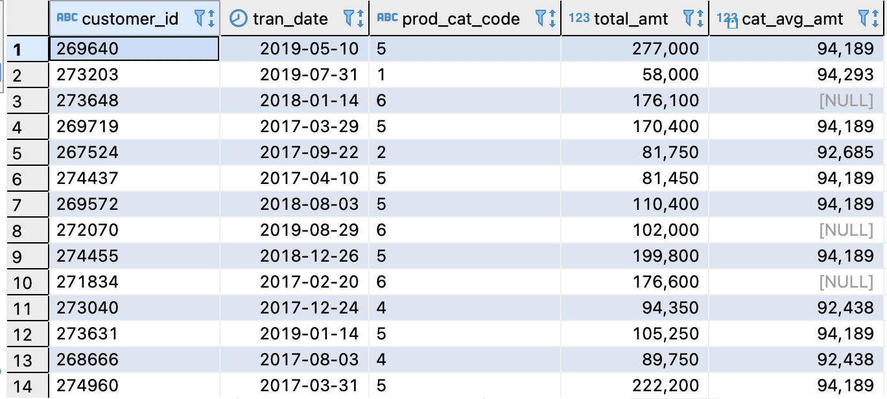

]

---

### 인라인 뷰(Inline View)

* #### FROM 절에서 조회 대상 집합으로 사용되는 서브 쿼리이다.

.pull-left[

```sql
SELECT  A.CUSTOMER_ID
     ,  A.AMT_2019
     ,  B.AMT_2020
FROM    ( SELECT A.CUSTOMER_ID
              ,  SUM(A.TOTAL_AMT) AS AMT_2019
          FROM   TRANSACTIONS A
          WHERE  TO_CHAR(A.TRAN_DATE, 'YYYY') = '2019'
          GROUP BY A.CUSTOMER_ID ) A
LEFT OUTER JOIN
        ( SELECT B.CUSTOMER_ID
              ,  SUM(B.TOTAL_AMT) AS AMT_2020
          FROM   TRANSACTIONS B
          WHERE  TO_CHAR(B.TRAN_DATE, 'YYYY') = '2020'
          GROUP BY B.CUSTOMER_ID ) B
ON        A.CUSTOMER_ID = B.CUSTOMER_ID;
```

]

.pull-right[

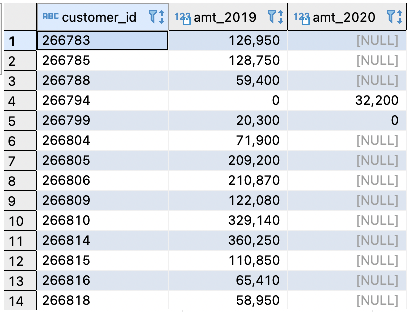

]

---

### WITH 절

* WITH절을 사용하면 **<u>서브 쿼리에 이름을 할당</u>**하고, .blue[메인 쿼리에서 참조]할 수 있다.

.pull-left[

**[WITH절 사용 예시]**
```sql
WITH TBL AS (
SELECT A.PROD_CAT_CODE
    ,  B.PROD_CAT
    ,  MAX(A.TOTAL_AMT)   AS MAX_AMT
    ,  MIN(A.TOTAL_AMT)   AS MIN_AMT
FROM   TRANSACTIONS A
JOIN   PROD_CAT_INFO B
ON     A.PROD_CAT_CODE = B.PROD_CAT_CODE
GROUP BY 1, 2
)
SELECT  T.PROD_CAT_CODE
    ,   T.PROD_CAT
    ,   T.MIN_AMT
    ,   T.MAX_AMT
FROM    TBL T;
```

]

.pull-right[

**[인라인 뷰 사용 예시]**
```sql
SELECT T.PROD_CAT_CODE
    ,  T.PROD_CAT
    ,  T.MIN_AMT
    ,  T.MAX_AMT
FROM   ( SELECT A.PROD_CAT_CODE
              , B.PROD_CAT
              , MAX(A.TOTAL_AMT)  AS MAX_AMT
              , MIN(A.TOTAL_AMT)  AS MIN_AMT
          FROM  TRANSACTIONS A
          JOIN  PROD_CAT_INFO B
          ON    A.PROD_CAT_CODE = B.PROD_CAT_CODE
          GROUP BY 1, 2 ) T;
```

]

---

class: inverse center middle

# 실무에서 많이 사용하는 쿼리 연습

---

### 주문번호(장바구니) 기준 카테고리(아이템, 상품) 조합별 집계

- 고객이 주문시 함께 주문하는 아이템, 상품, 카테고리 등을 집계하여 직관적으로 이해하기 위해 작성하는 쿼리

--

.pull-left[

**[결과]**

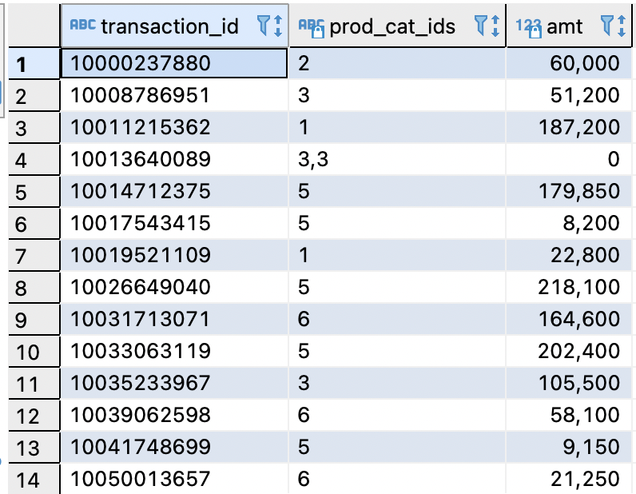

]

--
.pull-right[

**[쿼리]**
```sql
SELECT  A.TRANSACTION_ID
    ,   STRING_AGG(A.PROD_CAT_CODE, ',')    AS PROD_CAT_IDS
    ,   SUM(A.TOTAL_AMT)    AS AMT
FROM    TRANSACTIONS A
GROUP BY 1
ORDER BY 1;
```

**응용 예제**

1. 고객별로 카테고리 조합별 매출액 집계

2. 고객별로 구매연월 조합별 매출액 집계

]

---

### 연도별 카테고리 판매 순위 집계

- 각 연도별로 판매가 많이 된 카테고리를 순위로 나타내어 데이터를 파악할 수 있다.

--

.pull-left[

**[결과]**

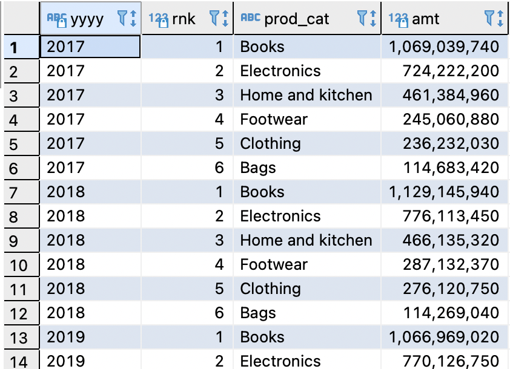

]

--
.pull-right[

**[쿼리]**
```sql
SELECT  T.YYYY
    ,   RANK() OVER (PARTITION BY T.YYYY ORDER BY T.AMT DESC)   AS RNK
    ,   T.PROD_CAT
    ,   T.AMT
FROM    (
          SELECT A.PROD_CAT_CODE
              ,  P.PROD_CAT
              ,  TO_CHAR(A.TRAN_DATE, 'YYYY')   AS YYYY
              ,  SUM(A.TOTAL_AMT)               AS AMT
          FROM   TRANSACTIONS A
          JOIN
                 PROD_CAT_INFO P
          ON     A.PROD_CAT_CODE = P.PROD_CAT_CODE
          GROUP BY 1, 2, 3 ) T
ORDER BY 1, 2;

```

]

---

### 이동평균을 사용한 날짜별 추이 보기

- 각 일자별 매출액을 집계한 후 집계된 매출 흐름이 상승하는 경향인지, 하락하는 경향인지 파악할 수 있다.

--

.pull-left[

**[일자별 매출과 7일 이동평균 그래프]**

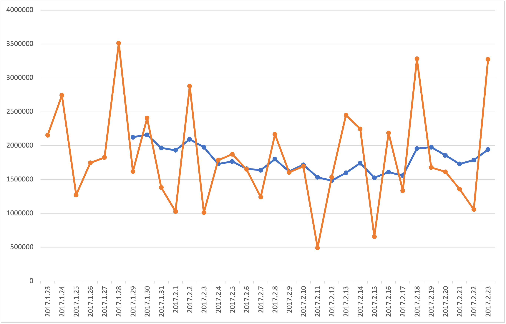

]

--
.pull-right[

**[결과]**
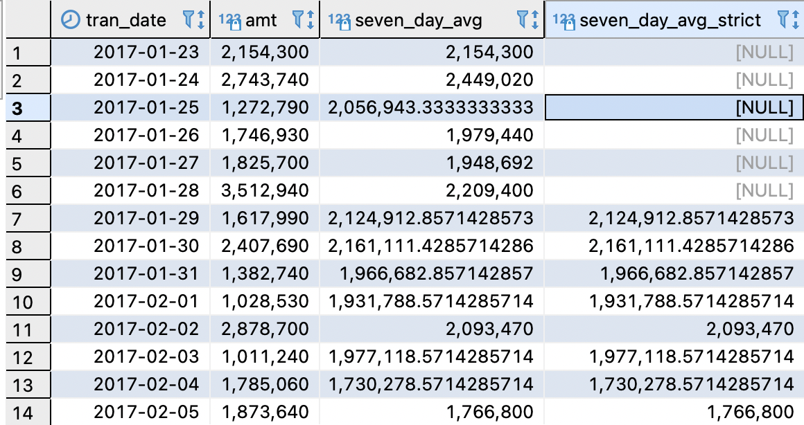

]

---

### 이동평균을 사용한 날짜별 추이 보기

- 각 일자별 매출액을 집계한 후 집계된 매출 흐름이 상승하는 경향인지, 하락하는 경향인지 파악할 수 있다.

--

.pull-left[

**[결과]**


]

--
.pull-right[

**[쿼리]**
```sql
SELECT    A.TRAN_DATE
    ,     SUM(A.TOTAL_AMT)    AS AMT
    ,     AVG(SUM(A.TOTAL_AMT)) OVER(ORDER BY A.TRAN_DATE ROWS BETWEEN 6 PRECEDING AND CURRENT ROW) AS SEVEN_DA_AVG
    ,     CASE WHEN 7 = COUNT(*) OVER(ORDER BY A.TRAN_DATE ROWS BETWEEN 6 PRECEDING AND CURRENT ROW)
               THEN AVG(SUM(A.TOTAL_AMT)) OVER(ORDER BY A.TRAN_DATE ROWS BETWEEN 6 PRECEDING AND CURRENT ROW) AS SEVEN_DAY_AVG_STRICT
FROM    TRANSACTIONS A
GROUP BY A.TRAN_DATE
ORDER BY A.TRAN_DATE;
```

]

---

### WINDOWING 절

* #### 각 행마다 분석 함수의 **<u>실행 대상이 되는 행의 범위(윈도우)</u>**를 세밀하게 지정한다.
* #### .blue[물리적인 행의 범위]를 지정하거나 .red[논리적인 값의 범위]를 지정할 수 있다.
* #### 각 행의 윈도우(실행 대상 행의 범위)는 파티션을 벗어날 수 없다.
* Syntax : ROWS/RANGE BETWEEN *start point* AND *end_point*

.center[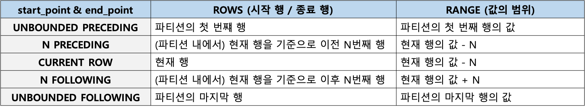]

---

### 당월 매출 누계 구하기

- 월별로 목표를 설정하는 실무에서는 날짜별 매출뿐만 아니라, 해당 월에 어느 정도의 매출이 누적되었는지를 확인할 수 있어야 한다.

--

.pull-left[

**[결과]**


]

--
.pull-right[

**[쿼리]**
```sql
WITH DAILY_AMT AS (
SELECT  A.TRAN_DATE
    ,   TO_CAHR(A.TRAN_DATE, 'YYYY-MM')   AS YM
    ,   SUM(A.TOTAL_AMT)                  AS AMT
FROM    TRANSACTIONS A
GROUP BY A.TRAN_DATE
)
SELECT  B.TRAN_DATE
    ,   B.YM
    ,   B.AMT
    ,   SUM(B.AMT) OVER(PARTITION BY B.YM ORDER BY B.TRAN_DATE ROWS UNBOUNDED PRECEDING)    AS AGG_AMT
FROM    DAILY_AMT B
ORDER BY B.TRAN_DATE;
```

]

---

### Z차트로 시계열 분석하기

- 고객에게 제공하는 서비스, 상품, 콘텐츠 중에는 계절에 따라 매출이 변동하는 경우가 많다.<br>**.blue[Z차트]**는 **'월별매출'**, **'매출누계'**, **'이동합계'** 3개의 지표로 구성되어, 계절 변동의 영향을 배제하고 트렌드를 분석하는 방법이다.

.pull-left[

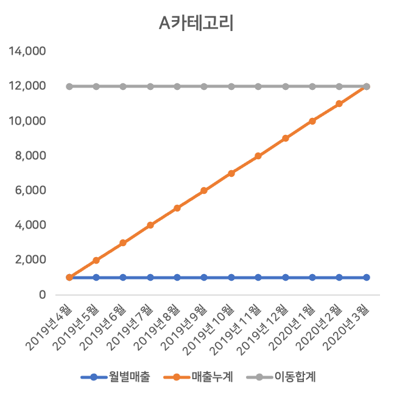

]

.pull-right[

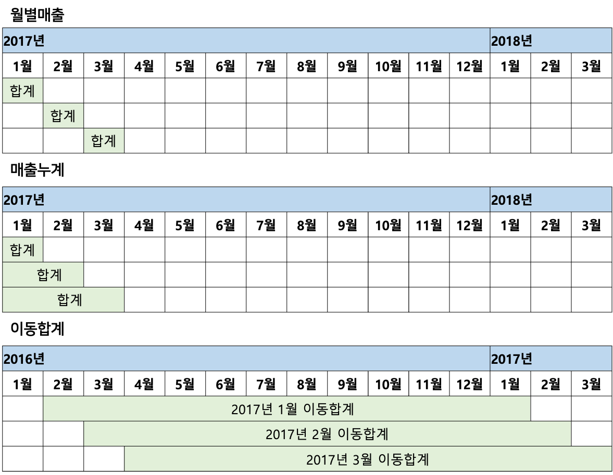

]

---

### Z차트로 시계열 분석하기

.center[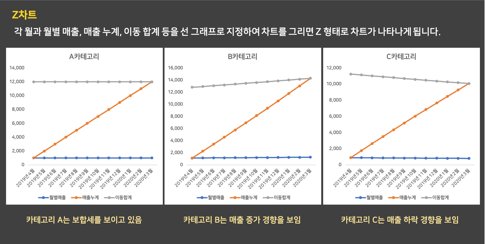]

---

### Z차트로 시계열 분석하기

--
.pull-left[

**[결과 - 2018년 매출에 대한 Z차트]**

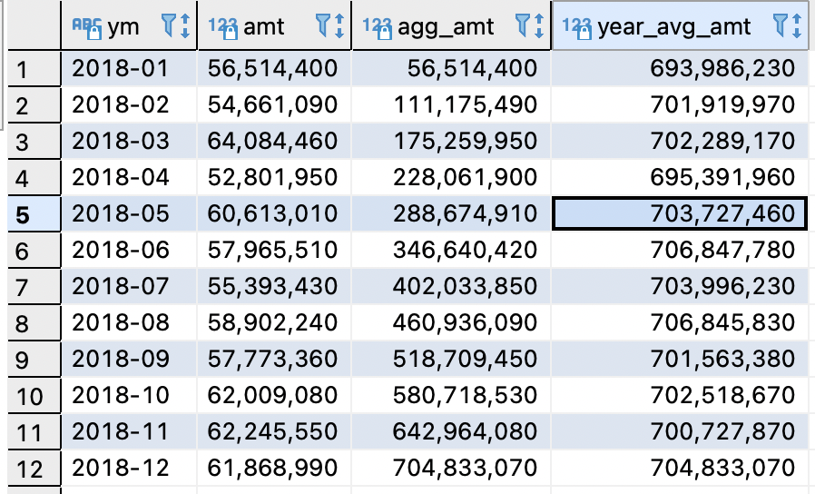

]

--
.pull-right[

**[쿼리]**
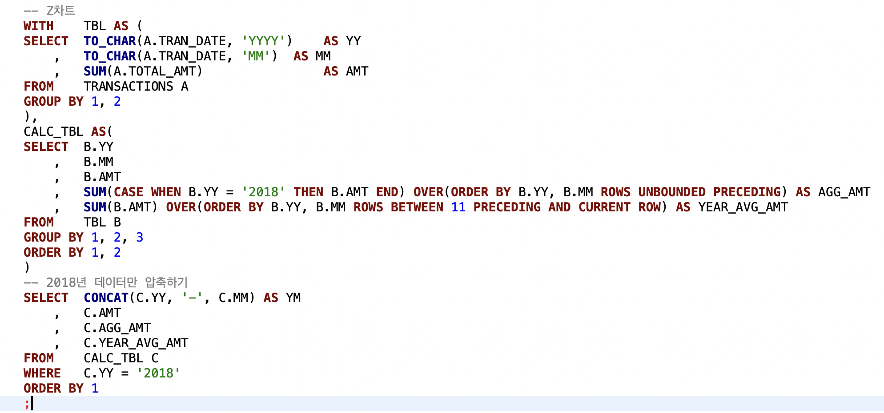

]

---

### ABC 분석으로 잘 팔리는 카테고리 판별하기

- ABC 분석은 통계적 방법에 의해 관리대상을 A, B, C 그룹으로 나누고, 먼저 A그룹을 최중점 관리대상으로 선정하여<br> 관리노력을 집중함으로써 관리효과를 높이려는 방법으로 **.blue[V.파레토의 법칙에서 도출된 분석방법이기 때문에 파레토 분석]**이라고도 함

.pull-left[

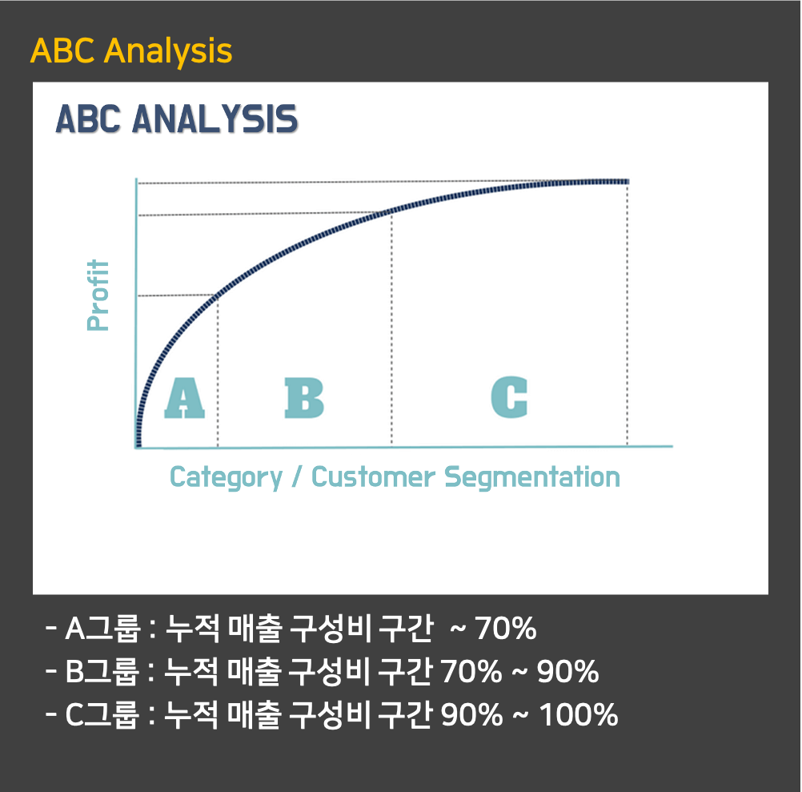

]

.pull-right[

**[결과]**

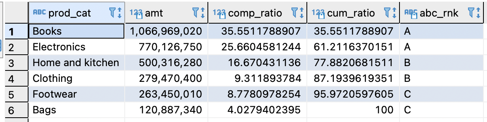

]

---

### ABC 분석으로 잘 팔리는 카테고리 판별하기

- ABC 분석은 통계적 방법에 의해 관리대상을 A, B, C 그룹으로 나누고, 먼저 A그룹을 최중점 관리대상으로 선정하여<br> 관리노력을 집중함으로써 관리효과를 높이려는 방법으로 **.blue[V.파레토의 법칙에서 도출된 분석방법이기 때문에 파레토 분석]**이라고도 함

**[쿼리]**<br>
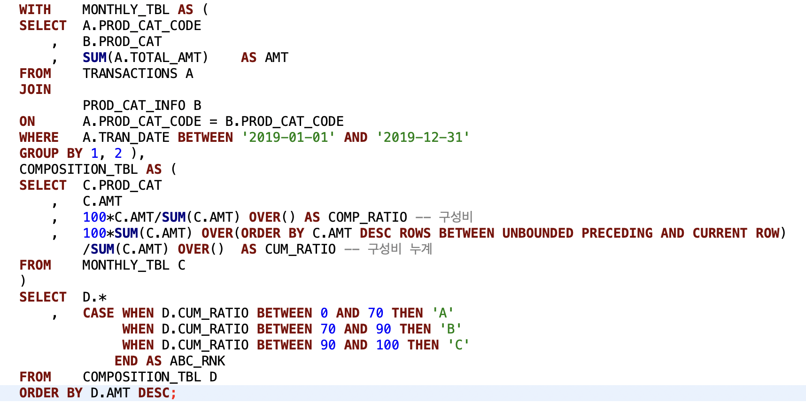

---

### 팬 차트로 카테고리의 매출 증가율 확인하기

- 팬 차트란 어떤 기준 시점을 100%로 두고, 이후 숫자 변동을 확인할 수 있게 해주는 그래프이다.

.pull-left[

**[팬 차트]**

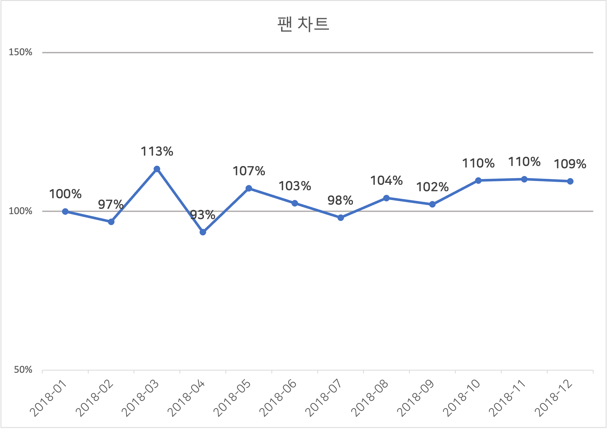

]

.pull-right[

**[결과]**
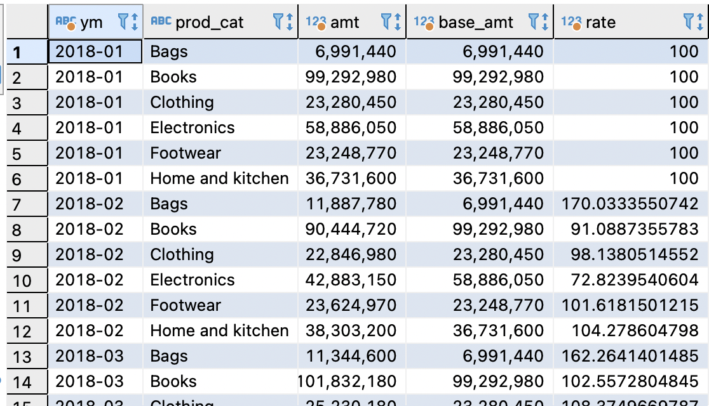

]
---

### 팬 차트로 카테고리의 매출 증가율 확인하기

- 팬 차트란 어떤 기준 시점을 100%로 두고, 이후 숫자 변동을 확인할 수 있게 해주는 그래프이다.

**[쿼리]**
```sql
WITH    CATE_AMT AS (
SELECT  TO_CHAR(A.TRAN_DATE, 'YYYY-MM')   AS YM
    ,   A.PROD_CAT_CODE
    ,   P.PROD_CAT
    ,   SUM(A.TOTAL_AMT)                  AS AMT
FROM    TRANSACTIONS A
JOIN    PROD_CAT_INFO P
ON      A.PROD_CAT_CODE = P.PROD_CAT_CODE
WHERE   TO_CHAR(A.TRAN_DATE, 'YYYY') IN ('2018', '2019')
GROUP BY 1, 2, 3 )
SELECT    B.YM
    ,     B.PROD_CAT
    ,     B.AMT
    ,     FIRST_VALUE(B.AMT) OVER(PARTITION BY B.PROD_CAT ORDER BY B.YM, B.PROD_CAT ROWS UNBOUNDED PRECEDING) AS BASE_AMT
    ,     100.0 * B.AMT / FIRST_VALUE(B.AMT) OVER(PARTITION BY B.PROD_CAT ORDER BY B.YM, B.PROD_CAT ROWS UNBOUNDED PRECEDING) AS RATE
FROM     CATE_AMT B
ORDER BY    B.YM, B.PROD_CAT;
    
```

---

### 카테고리 간 연관(교차) 구매 고객 현황 파악하기

- 특정 카테고리를 구매한 고객이 다른 카테고리를 연관(교차)하여 구매한 고객을 파악하여, Cross-Selling 전략을 세울 수 있다.

.pull-left[

**[연관(교차) 구매 Matrix]**

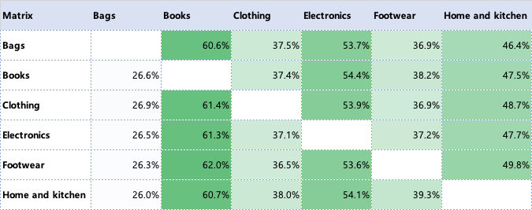

]

.pull-right[

**[결과]**
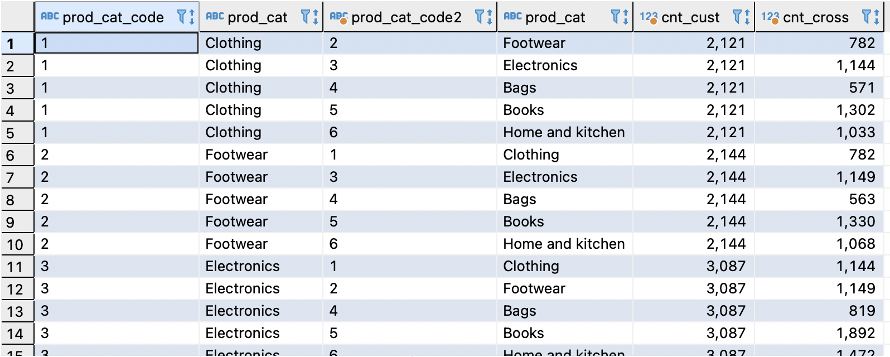

]

---

### 카테고리 간 연관(교차) 구매 고객 현황 파악하기

- 특정 카테고리를 구매한 고객이 다른 카테고리를 연관(교차)하여 구매한 고객을 파악하여, Cross-Selling 전략을 세울 수 있다.

```sql
SELECT  B.PROD_CAT_CODE   AS STD_CAT_CD ,   C1.PROD_CAT       AS STD_CAT
    ,   B.CROSS_CAT_CODE  AS CROSS_CAT_CD,   C2.PROD_CAT       AS CROSS_CAT
    ,   S.CNT_CUST,   COUNT(DISTINCT B.CUSTOMER_ID)   AS CNT_CROSS
FROM    (
          SELECT    DISTINCT T1.CUSTOMER_ID
              ,     T1.PROD_CAT_CODE
              ,     T2.PROD_CAT_CODE    AS CROSS_CAT_CODE
          FROM      TRANSACTIONS T1
          JOIN      ( SELECT    DISTINCT X.CUSTOMER_ID
                          ,     X.PROD_CAT_CODE
                      FROM      TRANSACTIONS X
                      GROUP BY  X.CUSTOMER_ID, X.PROD_CAT_CODE) T2
          ON        T1.CUSTOMER_ID = T2.CUSTOMER_ID     AND T1.PROD_CAT_CODE <> T2.PROD_CAT_CODE
          GROUP BY  1, 2, 3 ) B
JOIN    PROD_CAT_INFO C1    ON B.PROD_CAT_CODE = C1.PROD_CAT_CODE
JOIN    PROD_CAT_INFO C2    ON B.CROSS_CAT_CODE = C2.PROD_CAT_CODE
JOIN    ( SELECT    S.PROD_CAT_CODE, COUNT(DISTINCT S.CUSTOMER_ID)  AS CNT_CUST
          FROM      TRANSACTIONS S
          GROUP BY  S.PROD_CAT_CODE) S    ON B.PROD_CAT_CODE = S.PROD_CAT_CODE
GROUP BY    B.PROD_CAT_CODE, C1.PROD_CAT, B.CROSS_CAT_CODE, C2.PROD_CAT, S.CNT_CUST;
```

]

---

### 카테고리/상품 재구매율 구하기

- 카테고리 또는 상품에 대한 재구매율(재구매 고객수) 등을 구하는 쿼리를 통해 로열티를 측정할 수 있다.

.pull-left[

**[결과]**
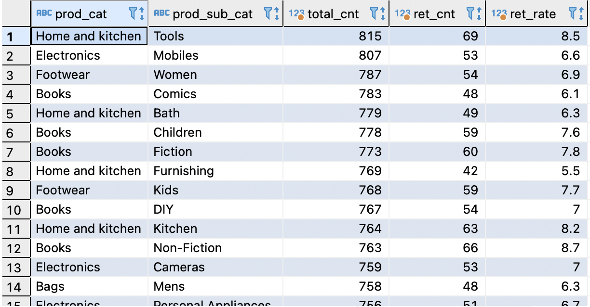

]

.pull-right[

```sql
SELECT  C.PROD_CAT
    ,   C.PROD_SUB_CAT
    ,   COUNT(DISTINCT C.CUSTOMER_ID)   AS TOTAL_CNT
    ,   COUNT(DISTINCT CASE WHEN C.CNT_ORDER > 1 THEN C.CUSTOMER_ID END)    AS RET_CNT
    ,   ROUND(100.0 * COUNT(DISTINCT CASE WHEN C.CNT_ORDER > 1 THEN C.CUSTOMER_ID END)/COUNT(DISTINCT C.CUSTOMER_ID), 1)    AS RET_RATE
FROM    (   SELECT    A.CUSTOMER_ID
                  ,   A.PROD_CAT_CODE
                  ,   P.PROD_CAT
                  ,   A.PROD_SUB_CAT_CODE
                  ,   P.PROD_SUB_CAT
                  ,   COUNT(DISTINCT A.TRANSACTION_ID)    AS CNT_ORDER
            FROM      TRANSACTIONS A
            JOIN      PROD_CAT_INFO P
            ON        A.PROD_CAT_CODE = P.PROD_CAT_CODE AND A.PROD_SUB_CAT_CODE = P.PROD_SUB_CAT_CODE
            WHERE     A.TRANSACTION_ID NOT IN ( SELECT B.TRANSACTION_ID
                                                FROM   TRANSACTIONS B
                                                WHERE  B.TOTAL_AMT < 0)
            GROUP BY  1, 2, 3, 4, 5) C
GROUP BY    1, 2
```

]

---

### Decile 분석을 사용해 사용자를 10단계 그룹으로 나누기

- 데이터를 총 10단계로 분할해서 중요도를 파악하는 'Decile' 분석을 위한 쿼리

.pull-left[

**[Decile 분석]**
* Decile은 10분의 1을 의미함

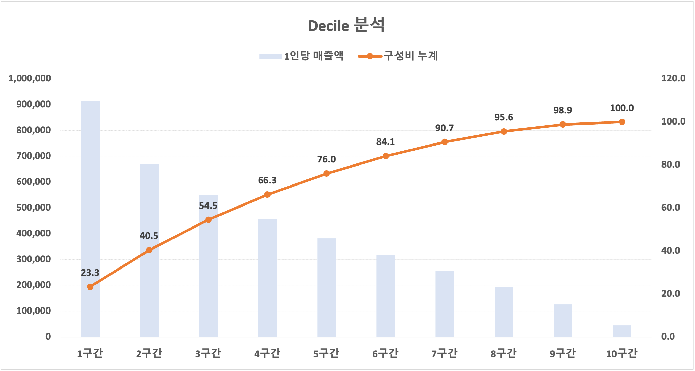


]

.pull-right[

**[결과]**
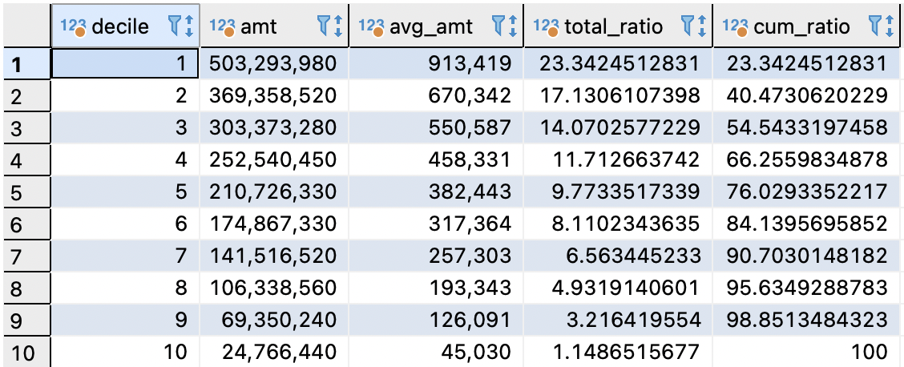


]

---

### Decile 분석을 사용해 사용자를 10단계 그룹으로 나누기

- 데이터를 총 10단계로 분할해서 중요도를 파악하는 'Decile' 분석을 위한 쿼리

**[쿼리]**
```sql
WITH    PURCHASE_TBL AS (
SELECT  A.CUSTOMER_ID, SUM(A.TOTAL_AMT)   AS AMT
FROM    TRANSACTIONS A
GROUP BY 1 )
, CUST_WITH_DECILE AS (
SELECT  B.CUSTOMER_ID, B.AMT, NTILE(10) OVER (ORDER BY AMT DESC) AS DECILE
FROM    PURCHASE_TBL B )
, DECILE_WITH_AMT AS (
SELECT  C.DECILE, SUM(C.AMT) AS AMT, AVG(C.AMT)   AS AVG_AMT
    ,   SUM(SUM(C.AMT)) OVER (ORDER BY C.DECILE)  AS CUM_AMT
    ,   SUM(SUM(C.AMT)) OVER ()                   AS TOTAL_AMT
FROM    CUST_WITH_DECILE C
GROUP BY 1 )
SELECT    D.DECILE, D.AMT, ROUND(D.AVG_AMT)   AS AVG_AMT
    ,     100.0 * D.AMT / D.TOTAL_AMT         AS TOTAL_RATIO
    ,     100.0 * D.CUM_AMT / D.TOTAL_AMT     AS CUM_RATIO
FROM      DECILE_WITH_AMT D;
```
