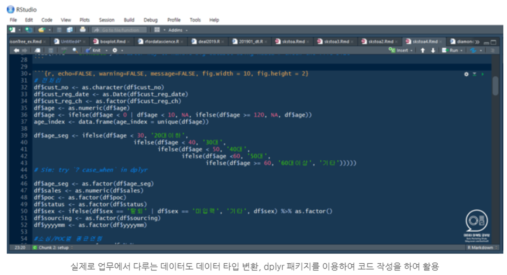
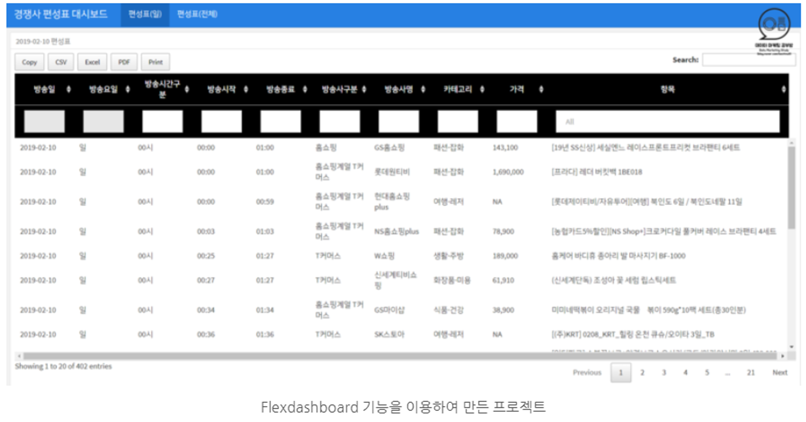

```{r setup, include=FALSE}
options(htmltools.dir.version = FALSE)
knitr::opts_chunk$set(
  fig.width=9, fig.height=3.5, fig.retina=3,
  out.width = "100%",
  cache = FALSE,
  echo = TRUE,
  message = FALSE, 
  warning = FALSE,
  fig.show = TRUE,
  hiline = TRUE,
  error = TRUE
)
```

```{r xaringan-themer, include=FALSE, warning=FALSE}
library(xaringanthemer)
style_mono_light(
  base_color = "#23395b",
  header_font_google = google_font("Do+Hyeon"),
  text_font_google   = google_font("Jua", "300", "300i"),
  code_font_google   = google_font("Fira Mono"),
  colors = c(
  red = "#f34213",
  purple = "#3e2f5b",
  orange = "#ff8811",
  green = "#136f63",
  white = "#FFFFFF",
  blue = '#0000FF',
  yellow = '#ffdd00'
)
)
```

### 데이터 분석 과정

.center[]


---

### R 프로그래밍에 대해서

프로그래밍언어 중 하나로 주로 데이터 마이닝, 빅데이터 프로세싱, 기계학습(머신러닝), 통계 분석 등 활용되며,<br> 오픈 소스로 배포되고 있어 .blue['무료']로 누구나 사용할 수 있다.

.pull-left[


]   

.pull-right[

**[R vs Excel]**


1. 한 번 했던 작업을 .blue[쉽게 재현]할 수 있습니다.
2. 처음 배울 땐 어렵고 오래 걸릴 수 도 있습니다.
3. 익숙해지면 .blue[빠르고 정확]하게 분석할 수 있습니다.
4. 데이터 구조와 특성에 대해서 .blue[논리적]으로 사고하게 됩니다.

]

---

### R vs 다른 언어들

.pull-left[
### R Studio의 Support

1. 안정적인 개발 환경을 제공합니다.

2. 확장 프로그램들을 통합하여 관리합니다.

3. 쉽고 직관적인 매뉴얼을 제공합니다.

4. 무한한 생태계 환경에서 스스로 학습이 쉽습니다.

]

.pull-right[

### 다른 언어들과 비교

1. METLAB : R과 가장 유사하며 수리 계산에 강점. .red[유료]

2. SAS : 초고용량 데이터 처리. .red[매우 유료(기업용)]
3. C, C++ : 배우기 어렵지만 빠르고 다른 언어의 토대가 됨

4. JAVA : C와 유사하지만 주로 웹개발 용으로 쓰임

5. Python : R과 양대 산맥으로 오픈소스 .blue[무료]<br>
 -분석과 개발의 양쪽을 지원하여 인기가 높음  
 -R에 비해서 난이도, 시각화, 문서화가 약점

]

---

### R은 왜 배워야 하나요?

#### 시대의 흐름

1. 데이터에 기반한 분석과 의사결정이 필수인 시대
2. 반복작업은 최대한 컴퓨터에게 맡겨야 하는 시대
3. 분석과 의사 결정을 하는 도구는 시대에 따라 진화
4. 암산 → 주판 → 엑셀 → 프로그래밍 → ???
5. 불과 20년 전에만 해도 엑셀 1급이면 전문가였습니다. 지금은 모두가 사용합니다.
6. 스마트폰에서 사진을 찍고 카톡에 첨부해서 보내는 기능도 예전에는 생소했습니다.

#### 지적인 발견

1. 유소년 교육도 구구단 → 19단 → 프로그래밍으로 트렌드 변화 (개발, 코딩을 배우는 초등학생)
2. 커리어 발전을 위해 다루는 데이터 구조를 파악하고 자동으로 처리해야 하는 역량 필수
3. 비전공자가 처음으로 배우기에 가장 쉽습니다. (저도 배웠으니깐요~)

---

### R의 작동 원리와 구조

.center[]

---

### R을 배우면 무엇을 할 수 있나요?

.center[]

---

### R을 배우면 무엇을 할 수 있나요?

.center[]

---

### R을 배우면 무엇을 할 수 있나요?

.center[]

---

### R을 배우면 무엇을 할 수 있나요?

.center[<iframe width="936" height="526" src="https://serviceapi.nmv.naver.com/flash/convertIframeTag.nhn?vid=F22F959BAC4A54BF95B87E48F7778B839E76&outKey=V12509b6073ad5a31d001679148945028271a6f1ee9e665c02d05679148945028271a" frameborder="no" scrolling="no" title="NaverVideo" allow="autoplay; gyroscope; accelerometer; encrypted-media" allowfullscreen></iframe>]

---

### 목표

1. R프로그래밍을 배웁니다.

2. 데이터 분석 프로젝트의 흐름을 익힙니다.

3. 개인/팀 프로젝트의 결과물을 만들어 냅니다.

4. When you start working, I hope you use this skill.

### 프로젝트 과정

.pull-left[
####1. 분석<br>
 -가설 설정  
 -데이터 분석

]

.pull-right[
####2. 공유<br>
 -시각화  
 -문서화

]
---
class: inverse center middle

# R 실습 환경 구축하기

---

### R 설치하기

구글에서 .blue['r download']를 검색하면 아래와 같이 **'R'**을 다운로드 받을 수 있는 페이지로 접속

.center[]

---

### R 설치하기

해당되는 OS 기준으로 R을 다운로드 받는 화면에 접속하여, 링크의 설치 파일을 다운로드

.center[]

---

### R 설치하기

다운로드 받은 파일을 실행시켜 R을 설치합니다.

.center[]

R을 설치하고나 나면 'R Studio'를 다운로드 받습니다.

---

### R Studio 설치

R studio는 R의 IDE로 R을 작동시키는 프로그램(?)이라고 생각하면 쉽습니다. 자동차로 비유하면 R은 엔진이며,<br> R studio는 핸들과 엑셀레이터, 브레이크, 기어 등으로 구성된 환경으로 운전자가 자동차를 움직이고 제어할 수 있는 장치 등을 의미

.center[]

R studio를 다운로드 받기 위해선 'R studio download'를 검색하여 위와 같은 페이지에 접속

---

### R Studio 실행

R studio는 항상 관리자 모드로 실행

.center[]

---

### R Studio 환경 설정

`Tools` - `Global options..` 에서 폰트, 색상 그리고 한글이 깨지는 현상을 방지하기 위한 텍스트 인코딩 등을 설정

.center[]

---

### 스크립트 창과 콘솔 창

.pull-left[
#### 스크립트 창

- 메모장과 같은 기능을 제공 (편집 및 저장)

- Ctrl + Enter
 - 커서가 있는 라인 또는 선택된 블럭
 
- Ctrl + Shift + 1
 - 스크립트 창이 전체화면으로 표시
 
#### 콘솔 창

- DOS창 처럼 R의 명령어를 실행할 수 있습니다.

- Enter

- Ctrl + Shift + 2
 - 콘솔 창이 전체화면으로 표시 
]

.pull-right[


]
---

### 아래 코드를 콘솔에 입력해보세요.

```{r, results=FALSE}
"Hello"
a <- 7
b <- a + 3
#install.packages("dplyr")
library(dplyr)
b
```

#### 에러가 없이 아래의 결과가 나오나요?

```{r, echo=FALSE}
b
```

- 우상단 패널에서 "History" 탭을 누르면 지금까지 실행한 명령을 볼 수 있습니다.

- 이들을 Copy하여 좌상단 스크립트 창에 Paste하여 입력하세요

- File -> Save As를 이용해서 `myfirst.R`로 저장하세요.

- Rstudio를 종료하고 저장된 위치에서 `myfirst.R`을 찾아 더블 클릭해보세요.

---

### 학습 순서

#### 1. R base 이해

- R의 기본 문법을 이해합니다.

#### 2. 'dplyr' 패키지를 이용한 데이터 처리

- `dplyr` 패키지를 이용하여 데이터를 원하는 형태로 가공하고 다룹니다.

#### 3. 'ggplot2' 패키지를 이용한 데이터 시각화

- `ggplot2` 패키지를 이용하여 데이터를 시각화하여 분석하고 공유할 수 있습니다.

#### 4. 'rmarkdown'을 이용한 문서화

- 'rmarkdown'을 이용하여 작성된 분석의 결과물을 문서화 할 수 있습니다.

#### 5. 'Flexdashboard'를 이용한 대시보드 제작

- 분석의 결과를 `Flexdashboard`를 이용하여 대시보드를 제작합니다.

---

## 프로젝트

### 1. 고객의 가치를 평가하는 RFM 분석

### 2. 상품 리뷰 분석을 위한 텍스트 분석

### 3. 월마트 매출 예측 프로젝트

### 4. 개인/팀 프로젝트 발표

---
class: inverse center middle

# R base 이해

---

### 변수와 함수 (Variable & Function)

#### 문자(String, Character) 변수 입력

####1. 문자로 된 입력은 따옴표를 넣어줘야 합니다.

```{r}
"Hello"
```

####2. 변수 입력 (Variable Assignment)

```{r}
hi <- "Hello" # Assign "Hello" to variable name 'hi'
hi
```

####3. 문자끼리는 덧셈 기호를 이용해서 더할수 없다.

```{r}
hi + "World"
```

---

### 문자 두 개를 합치려면?

#### google "R combine two strings"

#### google "R에서 문자 합치기"

```{r}
paste(hi, "World")
```

R에서 +로 문자를 합칠 수 없습니다. 그러나, 파이썬에서는 가능합니다.<br>
이 모든 것을 다 외울수 없기 때문에 우리는 .blue[검색]을 활용해야 합니다.

### R에서 공백없이 문자를 합치는 방법을 스스로 해보세요.

**Hint.** google "R combine two strings without space"

--

```{r}
paste0(hi, "World")
```

---

### 변수 입력

###입력

####a라는 변수에 "apple"이라는 문자를 입력하는 명령

 - a = "apple" 을 사용해도 같음
 - 그러나 R에서는 집어넣는 다는 의미로서 "**<-**"을 권장 (파이선에서는 "=" 사용)
 - 홑따옴표(')와 쌍따옴표(")의 기능은 대부분 경우에 같음
 
####아래의 4가지 명령은 동일합니다.
 
```{r results=FALSE}
a <- "apple"
a <- 'apple'
a = "apple"
a = 'apple'
```
 
---

### 입력 확인

- **"=="** (is equal)는 같으면 TRUE 다르면 FALSE를 반환
- **"!-"** (is not equal)는 같으면 FALSE 다르면 TRUE를 반환

```{r}
a == "apple"
a != "apple"
a == "samsung"
```

#### 현재 메모리에 a라는 변수에 어떤 값이 들어있는지 확인
```{r results=F}
print(a)
cat(a)
```

---

### 변수의 이름

1. #### 변수 이름은 영어로 지으세요
2. #### 특수 문자는 대부분 사용이 불가능합니다. (단, "_", "." 예외)
3. #### 빈 칸 없이 지으세요

### 좋은 이름을 짓는 방법?

1. **sknewschool** : 가독성이 떨어짐

2. **SKnewschool** : Camel 방식 (가독성이 좋음, R에서 주로 사용하는 방식)

3. **sk_new_school** : 전통적인 방식 (대소문자 구분이 없이 사용, 아직도 많이 사용되고 있음)  
<br>

> "좋은 프로그래머가 되려면 두 가지를 잘해야 하는데, 하나는 메모리를 잘 관리하는 것이고
>
>다른 하나는 이름을 잘 짓는 것이다". - Advanced R

---

### 함수 (Function)

.pull-left[

#### 함수는
  1. 입력(Input)을 가지고
  2. 어떤 행동을 수행하고
  3. 그 결과로서 출력(Output)을 반환(Return)하는 것
  
#### 함수가 수행하는 행동
  1. 처리(process)
  2. 생성(generate, populate)
  3. 변환(convert)
  4. 표시(display, print)
  5. 합치기(aggregate, combine, concatenate, merge)
  6. 추출(filter)
  7. 저장(save, write)
  8. 불러오기 (load, infile, read)
  
]

.pull-right[

.center[]

]
  
---

### 데이터 타입(Data Type)

1. 문자형 데이터(character)

.pull-left[

```{r}
hi <- "BTS says \"Hello World!\""
nchar(hi)
substr(hi, 5, 8)
hi # show
cat(hi) # Show cleanly
```

]

.pull-right[

#### 따옴표를 입력할 때는 backslash를 앞에 붙여줍니다.
#### `substr`은 SUBest of STRing, 즉 문자열 변수의 부분 집합을 추출합니다.
#### `cat` 함수를 사용하면 backslash를 빼고 출력해줍니다.
#### 지금까지 배운 string 관련 함수

```{r results=F, eval=F}
paste(string1, string2, sep)
paste0(string1, string2)
nchar(string1)
substr(string1, start, end)
cat(string)

```


]

---

### R Cheat-sheet 활용

#### R의 Base에 관한 Cheat-sheet에 소개된 캐릭터 관련 주요 함수입니다.

#### 검색, Cheat-sheet 그리고 Trial & Error가 여러분의 실력을 향상 시켜줍니다.

.center[]

[**R Cheat-sheet Download**](https://www.rstudio.com/resources/cheatsheets/)

---

### 데이터 타입(Data Type)

2.숫자형 데이터(numeric)

#### 숫자형 데이터는 계산기 처럼 사용할 수 있습니다.

```{r}
10^2 + 100
a <- 5
a
a*5
a <- a + 20
a
```

---

### 데이터 타입(Data Type)

3.논리형 데이터(logical)

#### 참과 거짓 (TRUE와 FALSE)

#### TRUE는 1, FALSE는 0에 대응

```{r}
2==3
5>3
```

.center[]

---

### Data Type의 확인과 변환

.pull-left[

#### is.DATATYPE() 함수
 -해당 데이터 타입이 맞으면 TRUE 아니면 FALSE 반환

```{r}
is.character(5)
is.character("5")
```

]

.pull-right[

#### as.DATATYPE() 함수
 -해당 데이터 타입으로 변환
 
```{r}
a <- 5
as.character(a)
is.character(a)
b <- as.numeric(a)
is.numeric(b)
```


]

---

### Data Type의 확인과 변환

#### class() 함수
 -데이터 타입을 바로 확인할 수 있습니다.
 
```{r}
class(5)
class("TRUE")
class(TRUE)
```


---

### string - numeric - logical 간의 변환

#### 함수에 따라서
 -입력(input)에 해당하는 인수(argument)의 지정된 type이 있습니다.
 -출력(output)값의 지정된 type이 있습니다.
 -그렇기에 type을 확인하고 변환할 수 있어야 합니다.
 
.center[]

---

### 데이터 타입(Data Type)

4.범주형 데이터(factor, Categorical)

.pull-left[

#### 데이터가 소속된 group을 나타내는 변수
 -숫자 vs Categorical
  - 더하고 뺄 수 있다면 numeric
  - 1, 2, 3을 A, B, C로 바꿔도 무리가 없다면 Categorical
  
-문자 vs Categorical
 - Exclusive (배타적) 집합이고, 각 객체가 1개 그룹에 속한다면 Categorical
 
-Kewords
 - "Classfication", "분류", "집단", "Group", "범주"

]

.pull-right[

<br><br>
-예시
 - 성인남자, 성인여자, 미성년자
 - 날씨 (맑음, 흐림, 비 옴)
 - 상품대분류 (여성패션, 남성패션, 패션잡화, 식품, 가전...)

-생성
 - `data.frame` 생성시에 `stringAsFactors = TRUE` 사용하면 모든 문자 객체가 factor가 됨
 - `as.factor()` 함수를 이용해서 변환할 수 있음

]

---

### 데이터 타입(Data Type)

5.날짜형 데이터(Date)

.pull-left[

```{r}
dates <- as.Date(c("2021-06-06", "2021-07-06"))
dates[1] - dates[2]
today <- Sys.Date() # today
today
# year
as.numeric(substr(today, 1, 4))
# month
as.numeric(substr(today, 6, 7))
```

]

.pull-right[

**character인 "2021-06-06"를 as.Date() 로 변환하여 Date 변수를 생성**

**c()는 두 개의 데이터를 combine하여 vector를 만드는 함수**

<br>
**`Sys.Date()`는 오늘 시스템 날짜**

<br><br><br>
**Date 객체도 character처럼 substr() 가능**

]

---

### 데이터 구조 (Data Structure)

#### 자료형(type) vs 자료구조 (structure)

1.자료형
 - 변수에 입력된 하나의 값의 특성
 - 0차원, 하나의 점, 하나의 값, singleton
 
2.자료 구조가 필요한 이유
 - 하나의 값이 하나의 변수가 된다면 -> 변수의 갯수가 너무 많아짐
 - 엑셀에서도 A컬럼, 1번행 등으로 **묶어서** 처리하는 기능을 제공
 
3.자료 구조
 - 각각의 값(singleton)들이 모여 있는 구조
 - 대용량 데이터도 한 번에 포함할 수 있기에 데이터 분석에서 중요
 - 엑셀에서 1개의 컬럼, 1개의 네모 블럭, 1개의 워크시트, 1개의 파일 모두 자료 구조에 해당
 
4.자료 구조의 이해
 - 몇 개의 관찰값이 있는가?
 - 어떤 규칙을 가지고 있는가?

---

### `vector`

### 문자 벡터
 - 길다랗게 저장되어 있는 데이터 구조
 - `c()`함수를 이용해서 벡터를 만들 수 있음
 - `paste`함수는 `string`으로 된 `vector`에도 적용이 가능

```{r}
strVec1 <- c("I", "Love", "You")
strVec1
strVec2 <- c("Like you", "and Peace", "don't know me")
strVec3 <- paste(strVec1, strVec2)
strVec3
```

---

### 숫자 벡터
 -`seq()` 함수는 등차 수열을 만듬
 -a:b는 a부터 b까지 정수 벡터를 만듬
 
.pull-left[

```{r}
numVec1 <- c(30, 50, 70)
numVec1
numVec2 <- seq(30, 70, 20)
numVec2
numVec3 <- seq(from = 20, to = 1, by = -3)
numVec3
2:6
```

]

.pull-right[

-**`min` vs `pmin`**
```{r}
numVec4 <- c(25, 55, 80)
min(numVec1)
min(numVec1, numVec4) # by all
pmin(numVec1, numVec4) # by element
numVec1 > numVec4
```


]

---

### 숫자 벡터
 -subsetting (부분 선택)
 
```{r}
numVec1[2]
numVec1[-2]
numVec1[1:2]
numVec1[c(1, 3)]
```
 
---

### `matrix` (array)

.pull-left[

-사각형의 데이터 구조  
-matrix() 또는 array() 함수로 생성
 - data = c(9, 2, 3, 4, 5, 6)로 element들을 나열
 - ncol = 3으로 3개의 컬럼을 가진 matrix 생성
 - nrow로도 만들 수 있음
 
```{r}
mat <- matrix(data = c(9, 2, 3, 4, 5, 6), ncol = 3)
mat
```
 
]

.pull-right[

-비슷한 문법의 subsetting

```{r}
mat[1, 2] # first row, second column
mat[2, ] # second row
```

#### 엑셀이 연상되시나요? 새로운 것을 배우는 만큼 기존에 알고 있는 것과 연관을 많이 시켜보세요.

]

---

### `matrix` (array) 연산

-연산은 여러가지 방식으로 가능 (원소 단위, 행 단위, 열 단위)
 - mean()은 전체 element들에 대해서 평균을 구함
 - apply(MATRIX, 2, FUNCTION)
  - MATRIX의 각 column에 FUNCTION을 apply(적용)
 - apply(MATRIX, 1, FUNCTION)
  - MATRIX의 각 row에 FUNCTION을 apply(적용)

```{r}
mean(mat)
apply(mat, 2, mean)
apply(mat, 1, mean)
```

---

### `data.frame`

-`vector`를 모아서 네모낳게 만든 것이 `data.frame`
 - `data.frame()` 함수를 이용
 - `date`, `sky`, `temp`, `dust` vector가 `weather`라는 `data.frame`의 column이 됨
 - `data.frame`을 생성할 때는 `stringAsFactors = FALSE` 옵션을 넣어줌
 - (그렇지 않으면 string이 factor로 저장됨)

```{r}
weather <- 
  data.frame(date = c('2021-07-05', '2021-07-06', '2021-07-07'),
             sky = c("Sunny", "Cloudy", "Rainy"),
             temp = c(20, 15, 18),
             dust = c(24, 50, 23),
             stringsAsFactors = FALSE)
weather
```

**이제 정말 엑셀 화면이랑 비슷하지 않나요?**

---

### `data.frame`

-각 column은 변수에 해당하고 이름도 보존됨
-colnames()로 column의 이름을 확인할 수 있음
-`weather$sky`와 같이 특정 column만 선택 가능
-`weather[,2]`와 같이 matrix의 subsetting 방법도 적용 가능

```{r}
colnames(weather)
weather$sky
weather$sky == weather[,2]
```

-엑셀에서는 A열, B열, 2행, 3행 이렇게 column을 정의 합니다.
-R의 colnames() 와 rownames() 는 2차원 데이터 구조에 index를 부여합니다.

---

### `data.frame`

.pull-left[

-`class()`로 data structure도 확인 가능
-class(VECTOR)의 경우에는 element들의 type 확인 가능
-`sapply()`를 data.frame에 적용하면 각 column에 같은 함수를 적용

```{r}
class(weather)
class(weather$date)
sapply(weather, class)
```

]

.pull-right[

-`date` 벡터의 type이 `character`이므로 `Date`로 변환
-str() 함수는 데이터의 구조를 보여주므로 자주 사용

```{r}
weather$date <- as.Date(weather$date)
str(weather)
```

]

---

### `list`

.pull-left[

```{r}
HMSon <- 
  list(team = c("Korea", "Tottenham"),
       birth = as.Date("1992-07-08"),
       goals =
         data.frame(team = c("20-21", "19-20", "A"),
                    goals = c(22, 18, 26),
                    stringsAsFactors = FALSE))
HMSon
```

]

.pull-right[

-list()로 다양한 데이터 구조를 함께 묶을 수 있음  
-사용하기 어렵지만, 때로는 유용함. 단, 실무에서 접할 일은 많지 않음  
-`str()`로 tree형 구조를 파악할 수 있음

```{r}
str(HMSon)
```


]

---

### 연습 문제

.pull-left[

**1번**
```{r, results=FALSE}
a <- "Hello"
a
```

answer:

**2번**
```{r, results=FALSE}
a <- "Hello"
b <- "World"
paste(a, b)
```

answer:

]

.pull-right[

**3번**
```{r, results=FALSE}
paste0(a, b)
```

answer:
<br>
<br>

**4번**
```{r, results=FALSE}
paste(a, b, sep = "-")
```

answer:

]

---

### 연습 문제

.pull-left[

**5번**

```{r, results=FALSE}
font <- "How are you?"
substr(font, 5, 7)
```

answer:

**6번**

```{r, results=FALSE}
nchar(font)
```

answer:

**7번**
```{r, results=FALSE}
grep("you", font)
```

]

.pull-right[

**8번**
```{r, results=FALSE}
gsub("How", "Who", font) # replace "How" by "Who" in 'font'
```

answer:

**9번**  
위의 명령은 다음과 같이 사용할 수도 있습니다. 어떤 장단점이 있을까요?
```{r, results=FALSE}
gsub(pattern = "How", replace = "Who", x = font)
```

answer:

**10번**
```{r, results=FALSE}
JulyDate <- "2021-07-07"
class(JulyDate)
```

answer:

]

---

### 연습 문제


**11번**
```{r, results=FALSE}
as.Date(JulyDate)
class(JulyDate)
```

answer:

**12번**
```{r, results=FALSE}
bool1 <- 2==5
bool2 <- grep(pattern = "el", x = "Hello World")
paste(bool1, bool2)
```

answer:

**13번**  
`문제12번` 위의 `bool2`를 1대신 `TRUE`로 바꾸려면 어떻게 해야 하나요?

answer:


---

### 연습 문제

.pull-left[

**14번**  
아래의 코드를 입력해보세요.
```{r}
players <- data.frame(
  name = c("HMSon", "JSPark"),
  number = c("7", "13"),
  id = c("920707-1234567", "810225-1357911"),
  stringsAsFactors = FALSE
)
players
```
]

.pull-right[

-`player$id`에서 맨 앞의 두 자를 이용해서 출생연도를 만들었습니다.

```{r}
players$year <- 
  paste0("19", substr(players$id, 1, 2))
players
```

```{r, results=FALSE, echo=FALSE}
players$month <- 
  substr(players$id, 3, 4)
players$day <- 
  substr(players$id, 5, 6)
players
```


-비슷한 방법으로 `players$month`와 `players$day`도 만들어보세요.

answer:

]
---

### 연습 문제

**15번**  
-아래의 `ifelse()` 함수는 처음 나왔지만 이해가 되시나요?  
-R의 많은 문법이 상식적이고 엑셀과도 비슷한 점이 많습니다.

```{r}
players$gender <- ifelse(substr(players$id, 8, 8) == "1", "Male", "Female")
players
```

-`paste()` 함수와 year, month, date를 이용해서 birth_date를 "YYYY-MM-DD" 형식으로 만들어보세요.

```{r, echo=FALSE}
players$birth_date <- 
  paste(players$year, players$month, players$day, sep = "-")
players
```

answer:

---

### 연습 문제

**16번**  
아래와 같이 코드를 입력하여, 필요한 변수만 모으고 각 변수의 type을 확인합니다.
```{r, results=FALSE}
players <- players[, c(1, 2, 7, 8)]
players
```

```{r, results=FALSE}
sapply(players, class)
```

-`birth_date`는 `Date`형으로, `gender`는 `factor`형으로 바꾸어보세요.

answer:

-성공적으로 수행한다면 아래와 같은 결과를 확인할 수 있습니다.

```{r, echo=FALSE, results=FALSE}
players$gender <- as.factor(players$gender)
players$birth_date <- as.Date(players$birth_date)
```


```{r}
sapply(players, class)
```

