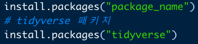
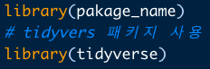
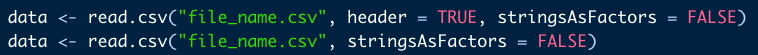
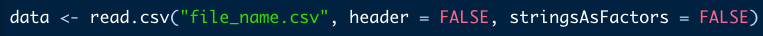
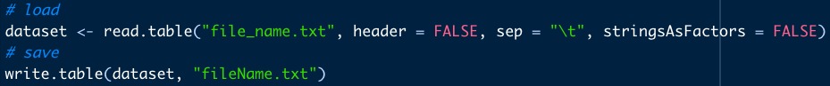
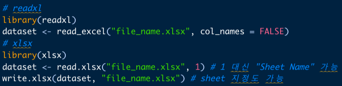

```{r setup, include=FALSE}
options(htmltools.dir.version = FALSE)
knitr::opts_chunk$set(
  fig.width=9, fig.height=3.5, fig.retina=3,
  out.width = "100%",
  cache = FALSE,
  echo = TRUE,
  message = FALSE, 
  warning = FALSE,
  fig.show = TRUE,
  hiline = TRUE,
  error = TRUE
)
```

```{r xaringan-themer, include=FALSE, warning=FALSE}
library(xaringanthemer)
style_mono_light(
  base_color = "#23395b",
  header_font_google = google_font("Do+Hyeon"),
  text_font_google   = google_font("Jua", "300", "300i"),
  code_font_google   = google_font("Fira Mono"),
  colors = c(
  red = "#f34213",
  purple = "#3e2f5b",
  orange = "#ff8811",
  green = "#136f63",
  white = "#FFFFFF",
  blue = '#0000FF',
  yellow = '#ffdd00'
)
)
```

### 패키지

.pull-left[

#### 정의
 -응용 프로그램, 확장 프로그램, library  
 -패키지는 데이터나 함수를 제공하는 프로그램
 
#### R의 Package
 -R을 처음에 설치하면 base라는 package가 설치되어 있습니다.  
 -base외의 확장 기능을 제공하는 패키지를 설치하여 사용합니다.  
 
#### Package의 위상
 -R과 Python은 오픈 소스 기반 언어  
 -누구나 패키지를 만들고 공유할 수 있습니다.  
 -많은 사람들이 패키지를 만들면서 발전과 생태계가 확장됩니다.

]

.pull-right[
#### 설치
 -base외의 패키지를 사용하려면 설치를 먼저 해주어야 합니다.  
 -마치 앱스토어, 플레이스토어에서 앱을 다운 받아 설치하는 것과 같습니다.  
 -따옴표를 넣어서 패키지의 이름을 입력합니다.  
 
&emsp;

#### 사용 선언
 -코드에서 패키지를 사용하기 전에 패키지 사용을 선언해주어야 함  
 -따옴표 없이 아래처럼 입력

&emsp;

]

---

### File Types

.pull-left[

#### Source 파일
 -서식(폰트의 종류와 크기)이 없기에 메모장에서도 편집/저장 가능  
 -.R : R 문법을 따르는 명령어로 구성  
 -.Rmd : 3가지 부분으로 구성되어 문서 생성
  - `Yaml` : 문서의 포맷 결정
  - `Markdown` : 워드프로세서처럼 자유롭게 작성
  - `R chunks` : R 명령어
  
]

.pull-right[

#### Data 파일
 -일반 데이터 파일
  - .csv : Comma Seperated Values  
  - .txt : 다양한 분리자로 구분된 파일  
  - .xls, .xlsx  
  
-R 데이터 파일
 - R에서 작업중인 데이터를 저장하고 불러오는 파일
 - .Rdata
  - 현재 메모리 상태를 저장하고 나중에 복원할 수 있음
  - 작업을 이어서 하는데에 유용
 - .Rda
  - 1개 함수나 변수를 저장하는 파일 

]

---

### 데이터 파일 입출력

####.csv  

 -첫 번째 행이 제목인 경우, 첫 번째 행이 **dataset**의 column name이 됨  
 -`header=TRUE`가 default input (입력하지 않아도 자동으로 `header=TRUE`가 됨)  
 -`stringAsFactors = FALSE`를 넣지 않으면 `data.frame`의 모든 string 변수가 factor형으로 저장됨  
 


 -첫 번째 행이 컬럼명이 아니라면 `header = FALSE` 입력
 


 -**dataset**을 `file_name.csv`로 저장하려면?
 


---

### 데이터 파일 입출력

####.txt

 -csv 파일은 구분자가 comma이기에 별도의 입력이 필요하지 않았지만  
 -txt 파일에서는 구분자(seperator, sep)를 입력해주어야 함.  
 -ex) `sep="\t" (Tab), sep="." (Period), sep="\n" (Linebreak)




####.xls, xlsx

 -패키지 등을 이용하여 불러오기, 저장 가능 (`readxl`, `xlsx`)  
 - `readxl` 패키지 기준 `col_names=FALSE`는 `header=FALSE`에 대응  
 - `stringAsFactors = FALSE`를 하지 않아도 string으로 저장  
 - `xlsx` 패키지 기준 불러올 sheet 순서 지정 가능  



