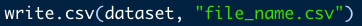

```{r setup, include=FALSE}
options(htmltools.dir.version = FALSE)
knitr::opts_chunk$set(
  fig.width=9, fig.height=3.5, fig.retina=3,
  out.width = "100%",
  cache = FALSE,
  echo = TRUE,
  message = FALSE, 
  warning = FALSE,
  fig.show = TRUE,
  hiline = TRUE,
  error = TRUE
)
```

```{r xaringan-themer, include=FALSE, warning=FALSE}
library(xaringanthemer)
style_mono_light(
  base_color = "#23395b",
  header_font_google = google_font("Do+Hyeon"),
  text_font_google   = google_font("Jua", "300", "300i"),
  code_font_google   = google_font("Fira Mono"),
  colors = c(
  red = "#f34213",
  purple = "#3e2f5b",
  orange = "#ff8811",
  green = "#136f63",
  white = "#FFFFFF",
  blue = '#0000FF',
  yellow = '#ffdd00'
)
)
```

### 패키지

.pull-left[

#### 정의
 -응용 프로그램, 확장 프로그램, library  
 -패키지는 데이터나 함수를 제공하는 프로그램
 
#### R의 Package
 -R을 처음에 설치하면 base라는 package가 설치되어 있습니다.  
 -base외의 확장 기능을 제공하는 패키지를 설치하여 사용합니다.  
 
#### Package의 위상
 -R과 Python은 오픈 소스 기반 언어  
 -누구나 패키지를 만들고 공유할 수 있습니다.  
 -많은 사람들이 패키지를 만들면서 발전과 생태계가 확장됩니다.

]

.pull-right[
#### 설치
 -base외의 패키지를 사용하려면 설치를 먼저 해주어야 합니다.  
 -마치 앱스토어, 플레이스토어에서 앱을 다운 받아 설치하는 것과 같습니다.  
 -따옴표를 넣어서 패키지의 이름을 입력합니다.  
 
&emsp;

#### 사용 선언
 -코드에서 패키지를 사용하기 전에 패키지 사용을 선언해주어야 함  
 -따옴표 없이 아래처럼 입력

&emsp;

]

---

### File Types

.pull-left[

#### Source 파일
 -서식(폰트의 종류와 크기)이 없기에 메모장에서도 편집/저장 가능  
 -.R : R 문법을 따르는 명령어로 구성  
 -.Rmd : 3가지 부분으로 구성되어 문서 생성
  - `Yaml` : 문서의 포맷 결정
  - `Markdown` : 워드프로세서처럼 자유롭게 작성
  - `R chunks` : R 명령어
  
]

.pull-right[

#### Data 파일
 -일반 데이터 파일
  - .csv : Comma Seperated Values  
  - .txt : 다양한 분리자로 구분된 파일  
  - .xls, .xlsx  
  
-R 데이터 파일
 - R에서 작업중인 데이터를 저장하고 불러오는 파일
 - .Rdata
  - 현재 메모리 상태를 저장하고 나중에 복원할 수 있음
  - 작업을 이어서 하는데에 유용
 - .Rda
  - 1개 함수나 변수를 저장하는 파일 

]

---

### 데이터 파일 입출력

####.csv  

 -첫 번째 행이 제목인 경우, 첫 번째 행이 **dataset**의 column name이 됨  
 -`header=TRUE`가 default input (입력하지 않아도 자동으로 `header=TRUE`가 됨)  
 -`stringAsFactors = FALSE`를 넣지 않으면 `data.frame`의 모든 string 변수가 factor형으로 저장됨  
 


 -첫 번째 행이 컬럼명이 아니라면 `header = FALSE` 입력
 


 -**dataset**을 `file_name.csv`로 저장하려면?
 


---

### 데이터 파일 입출력

####.txt

 -csv 파일은 구분자가 comma이기에 별도의 입력이 필요하지 않았지만  
 -txt 파일에서는 구분자(seperator, sep)를 입력해주어야 함.  
 -ex) `sep="\t" (Tab), sep="." (Period), sep="\n" (Linebreak)


####.xls, xlsx

 -패키지 등을 이용하여 불러오기, 저장 가능 (`readxl`, `xlsx`)  
 - `readxl` 패키지 기준 `col_names=FALSE`는 `header=FALSE`에 대응  
 - `stringAsFactors = FALSE`를 하지 않아도 string으로 저장  
 - `xlsx` 패키지 기준 불러올 sheet 순서 지정 가능  


---

### 경로 (path & directory)

  #### Working directory
  
- R 엔진이 인식하고 있는 현재 폴더

  - **getwd()**를 실행하면 확인 가능
  - **setwd("directory_you_want")**를 사용해서 변경 가능
  
- R Studio 실행 방식에 따라서 working directory가 달라짐

  - RStudio 아이콘을 더블클릭해서 실행 -> 디폴트 설정값
  - .R이나 .Rmd 파일들 더블클릭해서 실행 -> 해당 소스파일이 위치한 폴더
  
---

### 경로 (path & directory)

- 절대경로

  - Working Directory와 상관없이 전체 경로로 입력
  - EX1) **read.csv("C:/SKnewschoo/MD/data/file_name.csv")**
  
- 상대경로

  - Working Directory를 기준으로 입력
  - EX2) **read.csv("file_name.csv")**가 제대로 작동하려면 Working Directory에 **file_name.csv**가 존재해야 함
  - EX3) Working Directory가 **"C:/SKnewschool/MD"** 인 경우에 **read.csv("/data/file_name.csv")**을 입력하면 EX1)과 같음
  - ..을 이용하면 상위 폴더 (parent directory)로 이동
  - EX4) Working Directory가 **"C:/SKnewschool/DS"** 인 경우에  
  **read.csv("../MD/data/file_name.csv")**을 입력하면 EX1) 과 같음
  
- Tip
  - Project 단위로 폴더를 만들어서 관리
  - 소스파일은 해당 폴더에 보관
  - 같은 폴더, 혹은 데이터 파일이 여러개인 경우에 /data/ 폴더에 데이터 파일 보관하면 상대경로를 이용해서 불러오기
  
---

class: inverse center middle

# dplyr 패키지

---

### Background

1. 직관적인 문법으로 빠르게 `data.frame`을 다루는 패키지
  - 가장 빠른 언어인 C를 기반으로 만듬
  - 가장 직관적인 SQL (Structured Query Language)과 유사하게 만들어져 있음
  - 코드 가독성이 높음
  - **그러나 base 명령어도 같이 알아두면 장점이 있음**
      - 타인의 코드 참조
      - 파이썬, SQL 등 다른 언어를 배울 떄 도움이 됨
      
2. 제작자 : `Hadley Wickhan, Ph.D.`
  - Head Scientist, Rstudio
  - `ggplot2, dplyr, reshape2, stringr` 등의 본인이 작성한 패키지를 묶어서 `tidyverse`라는 패키지로 묶음
  - 통계학 박사 후 R에서 다수의 사용하기 좋은 패키지 개발
  - `R for Data Science`의 저자
  
---

### Basic Manipulation

.pull-left[
- **rename**
  - 변수 이름 바꾸기
  - column의 이름을 바꿈
  
- **filter**
  - 관찰값 추출
  - row를 선택함
  
- **select**
  - 변수 추출
  - column을 선택함
  
- **arrange**
  - 관찰값 정렬
  - row를 재정렬함
]

.pull-right[
- **mutate**
  - 변수 생성
  - column을 만듬
  
- **group_by + summarise**
  - Categorical 변수를 이용해 집계
  
- **inner_join, left_join, full_join**
  - inner_join : 매칭된 두 관측값을 포함
  - left_join : left에 위치한 모든 관측값을 보존한다
  - full_join : 양 쪽의 모든 관측값을 보존한다
  
- **semi_join, anti_join**
  - semi_join(x, y)는 y와 매치되는 x의 모든 관측값을 보존
  - anti_join(x, y)는 y와 매치되는 x의 모든 관측값을 삭제
  

]

---

### 1. rename(이름 바꾸기)


---

### 2. filter(관찰값 추출, Row 추출)

.pull-left[

 - 'Rate'가 5000보다 작은 관찰값 추출  
 


]

.pull-right[

 - 'Rate'가 0보다 크고 5000보다 작은 관찰값 추출
 
 

]

---

### 3. select(변수 추출, Column 선택)


---

### 4. arrange(정렬)

.pull-left[

#### Ascending ( 1 - 2 - 3)


]

.pull-right[

#### Descending ( 3 - 2 - 1)


]

---

### 5. mutate(새로운 변수 만들기)

.pull-left[

#### add to columns


]

.pull-right[

#### mutate with ifelse


]

---

### 6. group_by + summarise

### 'Store type' 별로 'total_amt' 차이가 있을까요?

.pull-left[

#### Step 1. 'Store_type'별로 묶어서 (group_by)

#### Step 2. sum(total_amt)를 집계 (summarise)

#### Step 3. 새로운 데이터셋 'store_summary'이 만들어 짐

]

.pull-right[


]

---

### 7. inner_join, left_join, full_join

.pull-left[

#### dataset

```{r1}
a <- data.frame(fruit = c('apple', 'banana', 'kiwi'),
                sweet = c(4, 3, 6))

b <- data.frame(fruit = c('peer', 'banana', 'strawberry'),
                sweet = c(3, 3, 7))
a
b
```


]
